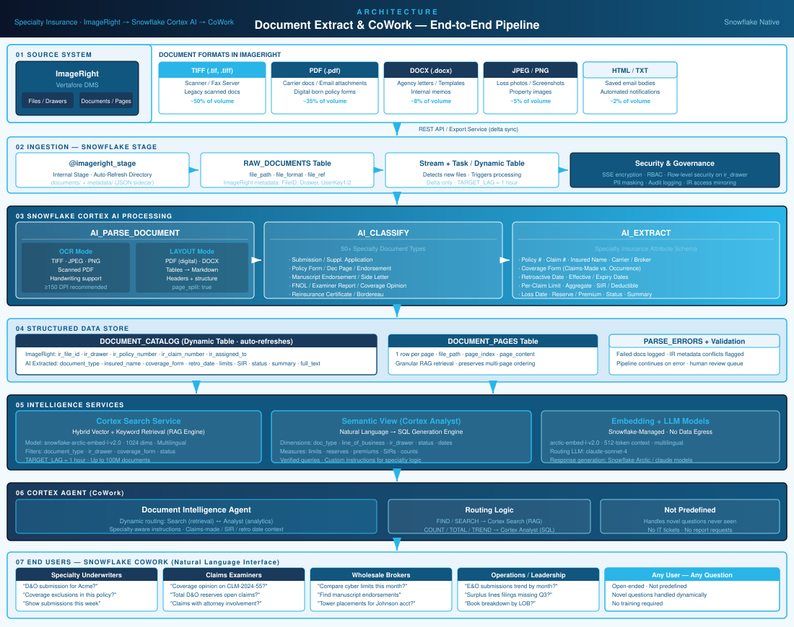

# Document Extract & CoWork
## AI-Powered Intelligence Over Infrastructure Investments Documents

### The Opportunity

Specialty deal organizations hold their most critical business intelligence locked inside source system — hundreds of thousands of submissions, policy forms, investment memos, deals files, and broker correspondence. Today, this content is **invisible to AI and analytics**. Finding a document requires knowing exactly where it lives. Answering *"What exclusions apply to this claim?"* means manually opening files and reading them.

The result: deal teams spend 30–40% of their time on document search. Deals examiners review entire files for a single policy term. Leadership has no real-time view of portfolio metrics.

### The Solution

**Document Extract & CoWork** transforms source system's document corpus into a conversational intelligence layer — enabling any authorized user to ask questions in plain English and get accurate, cited answers in seconds.

| What Users Ask | What the System Does |
|---|---|
| "Find the Digital Infrastructure submission for Acme Holdings" | Semantic search across all source folders and formats |
| "What exclusions apply to claim CLM-2024-5521?" | Retrieves and surfaces relevant policy language |
| "Total reserves across open Digital Infrastructure deals?" | Aggregates extracted data from thousands of documents |
| "Which regulatory filings are missing for Q3?" | Gap analysis without manual counting |
| *Any question not listed here* | Handled dynamically — not predefined |

**Key differentiator:** Questions are not predefined. The system handles novel questions through semantic search (Cortex Search) and AI-generated SQL (Cortex Analyst), routed by a Cortex Agent. No IT tickets. No report requests. No waiting.

### How It Works

Documents flow automatically from source system via REST API into Snowflake, where a fully managed pipeline processes them:

- **Extract** — AI_PARSE_DOCUMENT converts TIFF scans, digital PDFs, Word files, and images into structured text
- **Classify** — AI_CLASSIFY categorizes into 50+ specialty types: submissions, side letters, investment memos, IC Presentation, redeal certificates, regulatory filings
- **Extract Attributes** — AI_EXTRACT pulls key fields: policy limits, SIRs, retroactive dates, coverage form, insured names, loss dates, reserve amounts
- **Index & Serve** — Cortex Search (semantic retrieval) + Cortex Analyst (natural language analytics) + Cortex Agent (intelligent routing)

**100% Snowflake-native.** No third-party AI services. No data leaves your environment.

### Built for Infrastructure Investments

Purpose-built for E&S and specialty lines — Digital Infrastructure, Energy Transition, Water, Communications, Transportation, Professional Liability, Excess/Umbrella, Marine, Aviation, Surety, Facultative Redeal. The system understands deals-made triggers, retroactive dates, SIRs, manuscript policy language, Lloyd's syndicate structures, and wholesale distribution.

### Business Value

**Deals (Primary Focus)**

| Deals Workflow | Before | After |
|---|---|---|
| Find investment memo for a claim | Navigate source system folders manually | "What investment memos exist for claim CLM-2024-5521?" — seconds |
| Identify applicable exclusions | Read full policy form, page by page | AI surfaces the exact exclusion clause with policy citation |
| Reserve analysis across open deals | Pull files individually, build spreadsheet | "Total Digital Infrastructure reserves by examiner?" — real-time aggregation |
| Determine deals-made trigger | Open policy, locate coverage form and retro date | Retro date and coverage form extracted and queryable |
| Find prior similar deals | Manual search or institutional memory | Semantic search: "deals with attorney involvement and pollution exclusion" |
| Deal precedent research | Deal team reads 50+ page IC memo + DD reports | Agent retrieves all relevant deal terms in one query |
| New examiner onboarding | Weeks learning IR structure and file locations | Ask questions about any claim from day one |

**Deal Sourcing** — "Show me all Digital Infrastructure submissions with loss ratios above 80%" · "Which accounts are renewing in 60 days with open deals?" · "Find submissions mentioning SPAC or IPO exposure" · Faster triage, better risk selection

**Investor Relations** — "Compare IRR and MOIC across our digital infrastructure investments" · "Find all term sheets for Energy Transition deals" · "Which accounts are missing regulatory filings?" · Faster reporting, compliance visibility

**Operations / Leadership** — "Term Sheets by sector month over month?" · "Average time from IC Presentation to investment memo across Digital Infrastructure deals?" · Portfolio-level intelligence without BI tooling or IT requests

**Compliance / Legal** — "Surplus lines tax filings missing for Q3?" · "All investments expiring next 90 days with active deals?" · "Deals where notice of circumstance was filed?" · Automated gap detection

### Investment & Risk

**Costs scale with volume** — pay per page processed, per document classified, per GB/month indexed. No upfront infrastructure. No fixed seats. Digital PDFs (~35% of volume) skip OCR entirely — lower cost, higher accuracy.

**Risk is low** — source system remains the system of record. This pipeline adds intelligence on top, never modifying source data.

*Powered by Snowflake Cortex AI: AI_PARSE_DOCUMENT · AI_CLASSIFY · AI_EXTRACT · Cortex Search · Cortex Analyst · Cortex Agents · CoWork*

---

## Architecture: End-to-End Pipeline

