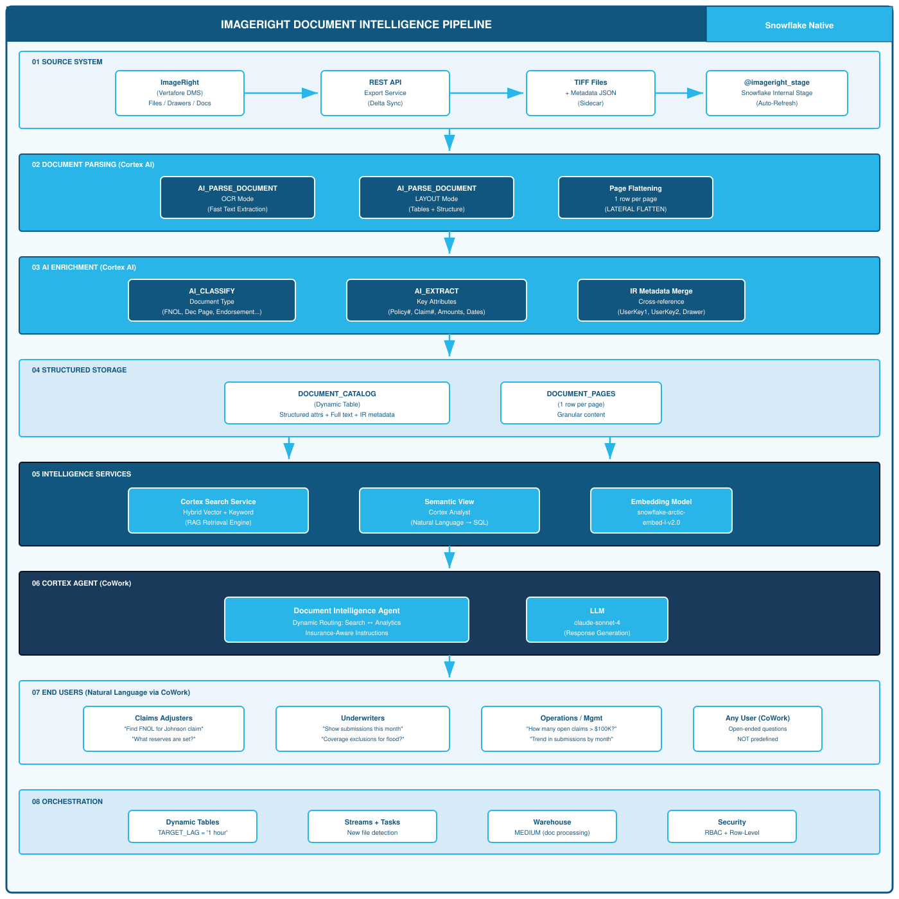
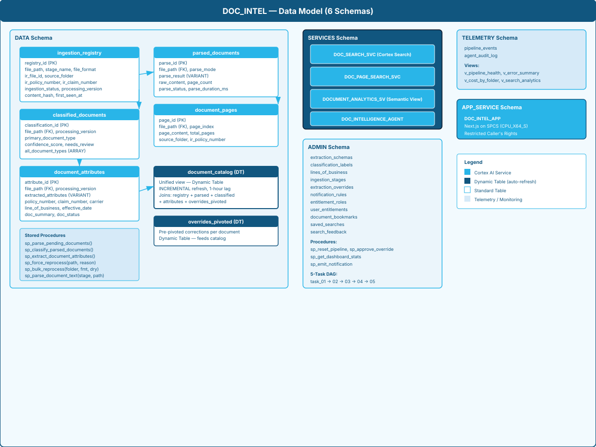

# Document Extract & CoWork: Product Plan

## source system Document Intelligence Pipeline with Snowflake AI

---

## Implementation Status (August 2026)

This section tracks what has been built against the original product plan. Phases 1–6 are complete and deployed to production at `https://fhfmn2pb-sfsenorthamerica-tboon-aws2.snowflakecomputing.app`.

### Completed (Phases 1–6)

| Phase | Components | Status |
|-------|-----------|--------|
| **1: Foundation** | Database, schemas, roles, stages, pipeline tasks (5-step DAG), ingestion registry | ✅ Complete |
| **2: AI Pipeline** | AI_PARSE_DOCUMENT, AI_CLASSIFY, AI_EXTRACT, document_catalog Dynamic Table | ✅ Complete |
| **3: Intelligence** | Cortex Search (doc + page level), Cortex Analyst semantic view, Cortex Agent | ✅ Complete |
| **4: Entitlements** | Multi-role RBAC, sector-scoped access, configurable sectors (CRUD), 5 default roles, download control | ✅ Complete |
| **5: App Core** | Next.js on SPCS — Search, Chat (agent+citations), Analytics, Document Browser, Admin, Dark/Light/System theme | ✅ Complete |
| **6: Document Detail + Review** | 4-tab detail page, inline editing, history, related docs, review queue | ✅ Complete |

### Planned (Phases 7–9)

| Phase | Target Features |
|-------|----------------|
| **7: Analytics Quality** | Classification trends, per-field accuracy, schema version control, sector matrix (partially complete: classification labels CRUD, sector CRUD, Test Lab with pin-based selection and full pipeline) |
| **8: Security Lifecycle** | PII detection, document purge/archive, retention investments, audit dashboard |
| **9: Collaboration UX** | Batch corrections, document annotations, notifications, in-app help |

### Architecture Notes (Updated)

> **sector vs Drawer:** The original design used source system "drawers" (Deals, Deal Sourcing, etc.) as the primary organizational dimension. As of Phase 4, **Sector (sector)** is the primary dimension for all filtering, access control, analytics, and review workflows. `source_folder` is preserved in ingestion for backward compatibility but is not the primary UI concept.

> **Dynamic Routes:** Snowflake App Runtime (SAR) cannot deploy Next.js `[param]` bracket directories. All document detail routes use query-param-based URLs: `/documents/detail?id=<base64url>`.

> **Entitlements:** No custom/direct entitlements exist. All access derives from role membership. Multi-role support allows users to hold multiple roles simultaneously with union semantics.

---


This product plan defines an end-to-end document intelligence system built on Snowflake's AI capabilities. The system ingests documents of all supported formats (TIFF, PDF, DOCX, JPEG, PNG) exported from **source system** (Vertafore's deal document management platform), extracts structured content, classifies document types, extracts key attributes, and makes the entire corpus queryable through Snowflake CoWork via Cortex Agents. The design is intentionally **open-ended**: users can ask arbitrary questions against the document corpus without predefined queries, leveraging retrieval-augmented generation (RAG) powered by Cortex Search and structured analytics powered by Cortex Analyst.

source system is the source of truth for **infrastructure PE** documents — excess & surplus (E&S) lines, professional liability, directors & officers (Digital Infrastructure), errors & omissions (Energy Transition), cyber liability, environmental liability, management liability, and other complex/non-standard risks. This pipeline unlocks AI-driven intelligence over that corpus without replacing source system as the system of record.

> **Architectural Note (July 2026):** The original design organized documents by source system "drawers" (Deals, Deal Sourcing, Redeal, etc.). This has been superseded by **Sector (sector)** as the primary organizational dimension. All UI filtering, analytics, and RBAC now use sector (Digital Infrastructure, Energy Transition, Water, Communications, Transportation, GL, Property, Excess/Umbrella) rather than drawer. The `source_folder` field is preserved in ingestion for backward compatibility but is not surfaced in the user interface. References to "drawer" elsewhere in this plan should be read as historical context.

---

## 2. Problem Statement

### 2.1 Current State

The organization uses **source system** (by Vertafore) as its primary document management system. source system stores infrastructure PE documents in multiple formats organized into a file-based hierarchy:

- **Files** (top-level containers, typically mapped to investments, deals, or accounts)
- **Drawers** (organizational groupings within a file)
- **Documents** (individual items — scanned TIFFs, PDFs, Word docs, emails-as-images)
- **Pages** (individual images within a multi-page document)

**File formats encountered in source system:**

| Format | Source | Prevalence |
|---|---|---|
| TIFF (.tif, .tiff) | Scanner output, fax server, legacy archives | ~50% |
| PDF (.pdf) | Digital-born documents, advisor reports, data room exports | ~35% |
| DOCX (.docx) | Agent-generated letters, templates, internal memos | ~8% |
| JPEG/PNG (.jpg, .png) | Photos (loss scenes, property), screenshots | ~5% |
| HTML/TXT | Email bodies saved as files | ~2% |

Typical document types stored in source system for infrastructure PE include:
- Excess & Surplus (E&S) line submissions and applications
- Investment memos, IC presentations, term sheets and DD reports
- Digital Infrastructure / Management liability declarations and side letters
- Cyber liability policy wordings and incident response plans
- Environmental liability site assessments and remediation reports
- Surplus lines tax filings and compliance certificates
- Specialty deals — complex liability, professional negligence, cyber breach
- Deal Sourcing submissions with supplemental applications (financials, loss history)
- Manuscript side letters and bespoke policy language
- Broker/wholesale correspondence and placement slips
- Lloyd's slip and market reform contract documentation
- Redeal treaty and facultative certificates
- Actuarial loss development triangles and reserve analyses

While source system provides workflow routing and basic metadata indexing, it does not offer:
- Semantic search across document content
- AI-powered classification or attribute extraction
- Natural language question answering
- Cross-document analytics or trend analysis

These documents remain opaque binary blobs — their content is unsearchable beyond source system's manual index fields, inaccessible to analytics, and invisible to AI-driven question answering.

### 2.2 Pain Points

| Pain Point | Impact |
|---|---|
| source system content not searchable by text | Users must know exact file/drawer location; cannot full-text search across TIFF content |
| Manual indexing burden | Staff manually key index fields (policy #, insured name) at scan time — errors and omissions common |
| No cross-document analytics | Cannot answer "how many open deals have reserve > $100K?" without manual counting |
| Siloed from policy admin systems | Document insights not joined with AMS, billing, or deals system data |
| No natural language access | Business users (adjusters, deal teams) cannot ask questions about document contents |
| Limited source system search | source system search is metadata-only; cannot find documents by what they *say* |
| Workflow bottlenecks | Documents sit in queues because nobody can quickly assess content without opening each one |

### 2.3 Desired State

A system where any authorized user can:
- Ask "Show me all Digital Infrastructure deals with reserves over $500,000 from Q3 2024" and get answers
- Ask "What are the coverage exclusions in the TechCorp cyber policy?" without knowing the source system file location
- Ask "How many Energy Transition submissions are pending deal team review for more than 7 days?" and get a precise count
- Ask "Find all investment memos mentioning insured-vs-insured exclusions" via semantic search
- Ask "What's the trend in cyber liability submissions month over month?" and get a chart
- Ask "Which investments in the excess tower have retro dates before 2020?" and get a filterable result
- Ask questions that were never anticipated at design time

---

## 3. Product Purpose & Goals

### 3.1 Purpose

Build an intelligent document processing pipeline that extracts documents of all formats (TIFF, PDF, DOCX, JPEG, PNG) from **source system** (Vertafore), transforms unstructured infrastructure PE documents into a searchable, queryable knowledge base, and makes them accessible through Snowflake CoWork's conversational AI interface.

### 3.2 Goals

1. **Automated Ingestion** — Documents (TIFF, PDF, DOCX, JPEG, PNG) exported from source system land on a Snowflake stage and are automatically processed without human intervention
2. **High-Fidelity Extraction** — OCR and layout analysis preserves text, tables, forms, and structural elements
3. **Intelligent Classification** — Documents are automatically categorized by type (submission, policy form, endorsement, claim notice, broker slip, redeal certificate, etc.)
4. **Attribute Extraction** — Key fields are extracted based on document type (amounts, dates, parties, reference numbers)
5. **Semantic Search** — Full document content is indexed for natural language retrieval via Cortex Search
6. **Structured Analytics** — Extracted attributes are modeled in a semantic view for Cortex Analyst queries
7. **Conversational Access** — Users interact through CoWork agents that dynamically route between search and analytics
8. **Open-Ended Questioning** — The system handles questions that were never pre-programmed

---

## 3A. Product Requirements (User-Facing Capabilities)

This section defines the product requirements from the perspective of **end users and stakeholders** — the specialty deal teams, deals examiners, wholesale brokers, actuaries, compliance staff, and operations managers who will interact with the system daily. Each requirement is framed as a capability with clear acceptance criteria.

---

### Feature 1: Unified Document Search

**Capability:** Users can search across the entire source system document corpus using natural language, without needing to know which drawer, file, or folder a document lives in.

**User Stories:**

| # | As a... | I want to... | So that... |
|---|---|---|---|
| 1.1 | Specialty Deal Team | search for "Digital Infrastructure submission Acme Holdings" | I can find the application without navigating source system's folder tree |
| 1.2 | Deals Examiner | search for "investment memo insured-vs-insured exclusion" | I can find relevant precedent opinions from prior deals |
| 1.3 | Wholesale Broker | search for "cyber liability manuscript endorsement" | I can reference similar endorsement language when negotiating a new placement |
| 1.4 | Compliance Officer | search for "HSR filing status for Q4 2024 acquisitions" | I can verify filings were completed without checking each file individually |
| 1.5 | Actuarial Analyst | search for "loss development triangle professional liability" | I can locate actuarial reports across multiple accounts |

**Acceptance Criteria:**
- [ ] Natural language queries return relevant results within 5 seconds
- [ ] Results are ranked by relevance (semantic similarity), not just keyword match
- [ ] Each result displays: document type, insured name, policy/claim number, date, and a content snippet
- [ ] Results are filterable by: document type, sector, status, date range
- [ ] System handles misspellings, synonyms, and partial terms (e.g., "Digital Infrastructure" matches "Directors and Officers")
- [ ] Works across all file formats — TIFF, PDF, DOCX, JPEG content is equally searchable
- [ ] Zero-training required: users type a question and get results immediately

**Priority:** P0 (Must-have for launch)

---

### Feature 2: Document Type Classification

**Capability:** Every document ingested from source system is automatically classified by type using AI, supplementing or correcting source system's native type field.

**User Stories:**

| # | As a... | I want to... | So that... |
|---|---|---|---|
| 2.1 | Operations Manager | documents auto-classified when they arrive | my staff doesn't spend 15 min/document manually tagging |
| 2.2 | Deal Team | to see AI-suggested type alongside IR's native type | I can catch misclassified submissions routed to the wrong drawer |
| 2.3 | Deals Examiner | investment memos distinguished from general correspondence | I can quickly filter to just coverage analysis documents |
| 2.4 | Compliance Staff | regulatory filings identified automatically | I can audit filing completeness across the book |

**Classification Taxonomy (50+ specialty types):**

| Category | Document Types |
|---|---|
| Deal Sourcing | Term Sheet, Supplemental App, Financial Statement, Quote, Indication, Binder, Declination |
| Policy | Declarations Page, Manuscript Endorsement, Standard Endorsement, Policy Form, Coverage Summary, Side Letter/DIC |
| Deals | IC Presentation, Claim Acknowledgment, DD Report, Reserve Worksheet, Investment Memo, Denial, Settlement, Subrogation |
| Certificates & Compliance | Certificate of Deal, Surplus Lines Filing, Regulatory Filing, Compliance Certificate |
| Correspondence | Broker/Wholesale, Carrier, Insured, Legal Notice/Subpoena |
| Redeal | Redeal Certificate, Treaty/Facultative Placement, Bordereau/Premium Report |
| Financial | Invoice, Commission Statement, Cancellation Notice, Premium Audit |
| Specialty Attachments | Actuarial Report, Risk Assessment, Third-Party Report (Cyber/Environmental), Medical Record, Incident Report, Appraisal, Photo |

**Acceptance Criteria:**
- [ ] Classification accuracy > 90% measured against human-labeled test set
- [ ] Multi-label support (a document can be both "Manuscript Endorsement" and "Coverage Summary")
- [ ] Classification runs automatically on every new document within 1 hour of upload
- [ ] When AI confidence is low (< 70%), document is flagged for human review
- [ ] AI classification and IR native type displayed side-by-side for validation
- [ ] New document types can be added to the taxonomy without code deployment

**Priority:** P0 (Must-have for launch)

---

### Feature 3: Key Attribute Extraction

**Capability:** The system automatically extracts structured data from unstructured document text — pulling out policy numbers, insured names, dates, limits, retentions, coverage forms, and other infrastructure PE fields.

**User Stories:**

| # | As a... | I want to... | So that... |
|---|---|---|---|
| 3.1 | Deal Team | policy number and effective dates extracted from submissions | I don't have to manually read every page to find key terms |
| 3.2 | Deals Examiner | claim numbers, loss dates, and reserve amounts extracted | I can see claim facts at a glance without opening each TIFF |
| 3.3 | Wholesale Broker | limits, retentions, and coverage form (deals-made/occurrence) extracted | I can quickly compare quotes across advisors |
| 3.4 | Actuarial Analyst | monetary amounts categorized (premium vs. limit vs. reserve) | I can aggregate financial data across the portfolio |
| 3.5 | Compliance Staff | retroactive dates and surplus lines identifiers extracted | I can audit deals-made tail exposure and tax compliance |

**Extracted Attributes (Infrastructure Investments):**

| Attribute | Description | Example Values |
|---|---|---|
| target_company | Named insured or applicant | "Acme Holdings, LLC" |
| deal_code | Policy or binder reference | "DOL-2024-005891" |
| fund_name | Claim/loss/occurrence # | "CLM-2024-12345" |
| sponsor_name | Lead sponsor or GP firm name | "DealIntelligence, KKR Infrastructure" |
| co_investors | Wholesale broker or MGA | "RT Specialty, Amwins" |
| line_of_business | Specialty sector | "Digital Infrastructure, Cyber, Energy Transition, EPL, Environmental" |
| deal_stage | Trigger type | "Deals-Made, Occurrence, Deals-Made-and-Reported" |
| retroactive_date | Prior acts date | "01/01/2018" |
| effective_date | Policy inception | "07/01/2024" |
| expiration_date | Policy expiry | "07/01/2025" |
| loss_date | Date of occurrence/wrongful act | "03/15/2024" |
| enterprise_value | Per-claim limit | "$5,000,000" |
| equity_check | Policy aggregate | "$10,000,000" |
| target_irr | SIR or deductible | "$250,000 SIR" |
| monetary_amounts | All financial values | Premiums, reserves, sublimits, settlements |
| exclusions_noted | Key coverage limitations | "Prior Knowledge, Pollution, BI" |
| status | Workflow state | "Bound, Quoted, Declined, Open, In-Litigation" |
| action_required | Next steps or deadlines | "Coverage counsel response due 7/15" |
| summary | 2-3 sentence document summary | AI-generated plain-language summary |

**Acceptance Criteria:**
- [ ] Extraction accuracy > 85% for key fields (policy #, dates, amounts) against validation set
- [ ] Monetary amounts correctly categorized (not conflating premiums with limits)
- [ ] Dates parsed into proper DATE type (not left as text strings)
- [ ] AI-extracted values cross-validated against source system's UserKey1/UserKey2 fields
- [ ] Conflicts between AI extraction and IR metadata flagged for review
- [ ] Handles multi-page documents (attributes can appear on any page, not just page 1)
- [ ] Extraction runs automatically within 1 hour of document ingestion

**Priority:** P0 (Must-have for launch)

---

### Feature 4: Conversational Question Answering (CoWork)

**Capability:** Users ask questions in plain English through Snowflake CoWork and receive accurate answers grounded in the document corpus — without writing SQL, navigating source system, or submitting IT requests.

**User Stories:**

| # | As a... | I want to... | So that... |
|---|---|---|---|
| 4.1 | Deal Team | ask "What's the loss history for Acme Holdings?" | I get a synthesized answer from multiple loss run documents |
| 4.2 | Deals Examiner | ask "What exclusions apply to claim CLM-2024-5521?" | I get the relevant policy language without reading the full form |
| 4.3 | Operations Manager | ask "How many cyber submissions are pending this week?" | I get a precise count without building a report |
| 4.4 | Actuarial Analyst | ask "What's the average retention across our Digital Infrastructure book?" | I get an aggregated answer from extracted attributes |
| 4.5 | Any User | ask a question nobody anticipated at design time | the system handles it through semantic search or SQL generation |

**Key Differentiator — NOT Predefined:**
Unlike traditional report systems, the CoWork agent handles **arbitrary questions** that were never programmed. This is possible because:
1. **Cortex Search** finds documents by meaning (semantic similarity), not just keywords
2. **Cortex Analyst** generates SQL dynamically from the semantic view based on question intent
3. **The agent** routes between these tools based on question type — retrieval vs. analytics

**Acceptance Criteria:**
- [ ] Response time < 10 seconds for typical questions
- [ ] Agent correctly routes between search (retrieval) and analyst (analytics) > 90% of the time
- [ ] All answers cite source documents (file path, insured name, document type)
- [ ] Agent gracefully declines when question cannot be answered ("I don't have that information")
- [ ] Follow-up questions work in context ("What about the same insured's cyber policy?")
- [ ] No training or onboarding required — users just type questions
- [ ] Works for questions never seen during development or testing

**Priority:** P0 (Must-have for launch)

---

### Feature 5: Portfolio Analytics & Reporting

**Capability:** Users ask quantitative questions about the document portfolio and receive precise, SQL-backed answers with optional visualizations — counts, totals, trends, comparisons, and breakdowns.

**User Stories:**

| # | As a... | I want to... | So that... |
|---|---|---|---|
| 5.1 | Operations Manager | ask "How many documents are in each drawer?" | I understand our document volume and distribution |
| 5.2 | VP Deal Sourcing | ask "What's the trend in Energy Transition submissions quarter over quarter?" | I can track pipeline growth without a BI dashboard |
| 5.3 | Deals Manager | ask "What's the total reserve across open Digital Infrastructure deals?" | I get a real-time portfolio view from document data |
| 5.4 | Compliance Officer | ask "How many regulatory filings are missing for Q3?" | I can identify compliance gaps proactively |
| 5.5 | CFO / Actuarial | ask "Break down premium volume by sector" | I see our book composition from source documents |

**Supported Analytics Patterns:**

| Pattern | Example Question | Output |
|---|---|---|
| Count | "How many IC Presentation documents this month?" | Single number |
| Sum / Average | "Average retention across cyber investments?" | Aggregated value |
| Trend | "Term Sheets by month for the last 12 months?" | Time series |
| Comparison | "Compare Digital Infrastructure vs. Energy Transition claim volumes" | Side-by-side |
| Breakdown | "Documents by type in the Deals drawer" | Category distribution |
| Filter + Aggregate | "Total limits for investments expiring in Q4 with retro before 2020?" | Filtered sum |
| Top N | "Top 10 insureds by document count?" | Ranked list |

**Acceptance Criteria:**
- [ ] Cortex Analyst generates correct SQL for > 85% of analytical questions
- [ ] Supports aggregation across all extracted numeric attributes (amounts, limits, pages)
- [ ] Supports time-series analysis on document_date, loss_date, effective_date, upload_timestamp
- [ ] Supports dimensional slicing by: document_type, sector, deal_stage, fund_name, geography
- [ ] Results include the generated SQL for transparency/auditability
- [ ] Verified queries cover the 20 most common operational questions
- [ ] Custom instructions handle specialty business logic (e.g., "expiring" = expiration_date within 90 days)

**Priority:** P1 (High — enables operational reporting without BI tooling)

---

### Feature 6: Multi-Format Document Processing

**Capability:** The system processes all document formats found in source system — not just TIFFs — using format-appropriate parsing strategies to maximize extraction quality.

**User Stories:**

| # | As a... | I want to... | So that... |
|---|---|---|---|
| 6.1 | Any User | search to work regardless of original file format | I get results from PDFs, scanned TIFFs, Word docs, and photos equally |
| 6.2 | Operations Manager | digital PDFs processed without quality loss | advisor-generated reports retain perfect text fidelity |
| 6.3 | Deals Examiner | photos (JPEG/PNG) with visible text to be searchable | handwritten notes or signage in loss photos can be found |
| 6.4 | IT Administrator | one pipeline handles all formats | I don't maintain separate systems per file type |

**Format Handling Matrix:**

| Format | Processing | Quality Expectation |
|---|---|---|
| PDF (digital) | LAYOUT — direct text extraction | 99%+ accuracy (no OCR needed) |
| PDF (scanned) | Auto-detected OCR + LAYOUT | 95%+ at 300 DPI |
| TIFF (scanned) | OCR + optional LAYOUT for tables | 95%+ at 300 DPI |
| DOCX | LAYOUT — native text extraction | 99%+ accuracy |
| JPEG/PNG | OCR | 90%+ for clear images |
| HTML/TXT | LAYOUT — direct parsing | 99%+ accuracy |

**Acceptance Criteria:**
- [ ] All 7 supported formats (TIFF, PDF, DOCX, PPTX, JPEG, PNG, HTML/TXT) process without manual intervention
- [ ] Format detection is automatic from file extension
- [ ] Digital-born PDFs achieve > 99% text accuracy (no OCR artifacts)
- [ ] Scanned documents (TIFF/scanned PDF) achieve > 95% accuracy at 300 DPI
- [ ] Tables in PDFs and DOCX files are extracted as structured Markdown
- [ ] Processing mode (OCR vs. LAYOUT) is selected automatically per format
- [ ] Corrupt or unreadable files are logged to an error table (not silently dropped)

**Priority:** P0 (Must-have — source system contains all these formats)

---

### Feature 7: source system Metadata Preservation & Cross-Reference

**Capability:** Every document processed retains its full source system lineage (FileID, Drawer, UserKeys, assignment) so users can trace answers back to the source system and existing workflows are not disrupted.

**User Stories:**

| # | As a... | I want to... | So that... |
|---|---|---|---|
| 7.1 | Any User | see the source system file ID in search results | I can navigate directly to the document in source system if needed |
| 7.2 | Operations Manager | filter by source system drawer | I can scope queries to just "Deals" or "Deal Sourcing" |
| 7.3 | Deal Team | search by policy number (IR UserKey1) | I find all documents for a policy regardless of which drawer they're in |
| 7.4 | Deals Examiner | search by claim number (IR UserKey2) | I find the complete claim file across all document types |
| 7.5 | Workflow Manager | see who a document is assigned to in IR | I can identify workload distribution without opening source system |

**Acceptance Criteria:**
- [ ] Every processed document retains: FileID, FileName, Drawer, DocumentType, UserKey1, UserKey2, AssignedTo, DateCreated
- [ ] IR metadata is searchable and filterable in Cortex Search
- [ ] IR metadata appears as dimensions in Cortex Analyst semantic view
- [ ] AI-extracted policy/claim numbers are cross-validated against IR UserKey1/UserKey2
- [ ] Mismatches between AI extraction and IR metadata are flagged in a validation report
- [ ] Users can ask "Show me all documents for policy [number]" and get results across all drawers

**Priority:** P0 (Must-have — traceability back to source system is non-negotiable)

---

### Feature 8: Automated Ingestion Pipeline

**Capability:** Documents flow from source system into the intelligence pipeline automatically — no manual file transfers, no batch scripts to babysit, no human triggers required.

**User Stories:**

| # | As a... | I want to... | So that... |
|---|---|---|---|
| 8.1 | IT Administrator | the pipeline to run unattended | I don't get paged for routine document processing |
| 8.2 | Operations Manager | new documents searchable within 1 hour | staff working deals or submissions see fresh content |
| 8.3 | IT Administrator | only new/modified documents to be processed | we don't re-process the entire 500K document backlog every day |
| 8.4 | Finance | costs to be predictable and proportional to volume | I can budget based on document inflow, not peak capacity |

**Pipeline Behavior:**
1. Export service polls source system API on a schedule (or reacts to IR events)
2. Only documents modified since last sync are downloaded (delta pattern)
3. Files + metadata sidecars uploaded to Snowflake stage
4. Stage directory auto-refreshes, triggering stream detection
5. Task/Dynamic Table processes new files through parse → classify → extract pipeline
6. Cortex Search service auto-refreshes index (TARGET_LAG = 1 hour)
7. New content is queryable in CoWork within 1 hour of IR upload

**Acceptance Criteria:**
- [ ] End-to-end latency from IR upload to CoWork-queryable: < 1 hour (configurable)
- [ ] Only new/modified documents processed on each cycle (no full reprocessing)
- [ ] Pipeline handles 1,000+ new documents/day without manual intervention
- [ ] Failed documents logged to error table; pipeline continues processing remaining docs
- [ ] Cost scales linearly with document volume (no fixed-cost overhead when idle)
- [ ] Historical backfill can be throttled to control initial load costs

**Priority:** P0 (Must-have for production use)

---

### Feature 9: Security & Access Control

**Capability:** Document access in the intelligence layer mirrors source system permissions — users see only documents they're authorized to view, with PII protected by masking investments.

**User Stories:**

| # | As a... | I want to... | So that... |
|---|---|---|---|
| 9.1 | CISO | document access governed by roles | unauthorized users cannot query sensitive deals or financials |
| 9.2 | Compliance Officer | PII (SSN, medical info) masked in query results | we maintain HIPAA/GLBA compliance |
| 9.3 | Operations Manager | my team to have document access via role grants | access is governed by DEAL_INTEL_ADMIN/USER/PIPELINE roles |
| 9.4 | Auditor | all CoWork queries logged with user identity | we have a complete audit trail of who accessed what |

**Acceptance Criteria:**
- [ ] Row-level security via role-based policy restricts document visibility (DEAL_INTEL_ADMIN/USER/PIPELINE)
- [ ] PII detected via Snowflake data classification (SSN, DOB, medical, financial)
- [ ] Masking investments applied to sensitive extracted attributes
- [ ] Audit logging captures: user, query text, documents returned, timestamp
- [ ] Users granted DEAL_INTEL_USER role get access to all documents; DEAL_INTEL_ADMIN for admin functions
- [ ] HIPAA-sensitive medical records accessible only to authorized deals roles

**Priority:** P0 (Must-have — regulatory and compliance requirement)

---

### Requirements Priority Summary

| Priority | Count | Features |
|---|---|---|
| **P0 — Must-have** | 7 | Search, Classification, Extraction, CoWork Q&A, Multi-Format, IR Metadata, Pipeline, Security |
| **P1 — High** | 1 | Portfolio Analytics & Reporting |
| **P2 — Nice-to-have** | (future) | Image analysis (loss photos), cross-system joins (AMS/billing), agent memory/follow-ups |

**MVP Definition:** P0 features constitute the minimum viable product. The system is launchable when all P0 acceptance criteria pass against a representative subset of the source system corpus (minimum 1,000 documents across 5+ specialty investment sectors).

---



> **Editable source:** [architecture.drawio](./architecture.drawio) — open in [diagrams.net](https://app.diagrams.net) or VS Code with the Draw.io extension.

---

## 5. Detailed Requirements

### 5.1 Ingestion Layer

#### R1: source system Export Integration

source system exposes documents via:
1. **REST API** (source system 6.x+) — HTTP endpoints for retrieving files, documents, and pages programmatically
2. **Send-to-Directory export** — Built-in feature to export files/documents to a file system directory
3. **Database-level access** — UserKey1/UserKey2 fields for cross-referencing with external systems

**Recommended Integration Pattern:**

```
source system REST API --> Export Service (Python/SPCS) --> Snowflake Internal Stage
```

The export service:
- Connects to source system Application Server via RESTful API
- Queries for documents modified since last sync (delta export)
- Downloads documents in their native format (TIFF, PDF, DOCX, JPEG, PNG)
- Captures source system metadata: file attributes, drawer, document type (IR's native type), index fields
- Uploads documents to Snowflake stage along with a metadata JSON sidecar
- Preserves original file extension for format-aware downstream processing

**source system Metadata Captured:**

| IR Field | Purpose |
|---|---|
| FileID | Unique identifier in source system |
| FileName | Display name of the IR file (often insured name or policy #) |
| Drawer | Organizational grouping (e.g., "Deals", "Deal Sourcing") |
| DocumentType | IR's native document type classification |
| UserKey1 | Primary cross-reference (typically policy number) |
| UserKey2 | Secondary cross-reference (claim number, account ID) |
| DateCreated | When the document was added to source system |
| DateModified | Last modification timestamp |
| PageCount | Number of pages in the IR document |
| AssignedTo | Workflow assignment (adjuster, deal team) |
| Status | IR workflow status |

#### R2: Stage Configuration

```sql
CREATE OR REPLACE STAGE deal_documents_stage
  DIRECTORY = (ENABLE = TRUE, AUTO_REFRESH = TRUE)
  ENCRYPTION = (TYPE = 'SNOWFLAKE_SSE');
```

Stage directory structure:
```
@deal_documents_stage/
  documents/
    {FileID}_{DocumentID}.tiff     -- Scanned documents
    {FileID}_{DocumentID}.pdf      -- Digital-born PDFs
    {FileID}_{DocumentID}.docx     -- Word documents
    {FileID}_{DocumentID}.jpg      -- Photos / screenshots
    {FileID}_{DocumentID}.png      -- Photos / screenshots
  metadata/
    {FileID}_{DocumentID}.json     -- IR metadata sidecar
```

**Requirements:**
- Support ALL formats accepted by AI_PARSE_DOCUMENT: PDF, TIFF, DOCX, PPTX, JPEG, PNG, HTML, TXT
- Multi-page TIFF and PDF files supported (up to 2,000 pages per file)
- Maximum file size: 100 MB
- Maximum page resolution: 10,000 x 10,000 pixels
- Directory table auto-refreshes to detect new uploads from export service
- Server-side encryption required
- Metadata sidecar preserves source system lineage (FileID, Drawer, UserKeys)
- File extension preserved for format-aware processing mode selection

#### R3: File Registration with IR Metadata

```sql
CREATE OR REPLACE TABLE raw_documents AS
SELECT
    t.RELATIVE_PATH AS file_path,
    TO_FILE('@deal_documents_stage', t.RELATIVE_PATH) AS file_ref,
    t.SIZE AS file_size_bytes,
    t.LAST_MODIFIED AS upload_timestamp,
    -- Derive file format from extension for format-aware processing
    UPPER(REGEXP_SUBSTR(t.RELATIVE_PATH, '\\.([^.]+)$', 1, 1, 'e')) AS file_format,
    -- Parse corresponding metadata sidecar
    m.ir_metadata,
    m.ir_metadata:FileID::VARCHAR AS ir_file_id,
    m.ir_metadata:FileName::VARCHAR AS ir_file_name,
    m.ir_metadata:Drawer::VARCHAR AS source_folder,
    m.ir_metadata:DocumentType::VARCHAR AS ir_document_type,
    m.ir_metadata:UserKey1::VARCHAR AS ir_deal_code,
    m.ir_metadata:UserKey2::VARCHAR AS ir_fund_name,
    m.ir_metadata:AssignedTo::VARCHAR AS ir_assigned_to,
    m.ir_metadata:DateCreated::TIMESTAMP AS ir_date_created
FROM DIRECTORY(@deal_documents_stage) t
LEFT JOIN (
    SELECT
        RELATIVE_PATH,
        PARSE_JSON(FILE_CONTENT) AS ir_metadata
    FROM DIRECTORY(@deal_documents_stage)
    WHERE RELATIVE_PATH ILIKE 'metadata/%.json'
) m ON REGEXP_REPLACE(
         REPLACE(t.RELATIVE_PATH, 'documents/', 'metadata/'),
         '\\.[^.]+$', '.json'
       ) = m.RELATIVE_PATH
WHERE t.RELATIVE_PATH ILIKE 'documents/%'
  AND REGEXP_LIKE(t.RELATIVE_PATH, '.*\\.(tif|tiff|pdf|docx|pptx|jpg|jpeg|png|html|txt)$', 'i');
```

**Requirements:**
- Process ALL AI_PARSE_DOCUMENT-supported formats: TIFF, PDF, DOCX, PPTX, JPEG, PNG, HTML, TXT
- Derive `file_format` column from extension for format-aware parsing mode selection
- Join with metadata sidecar to preserve source system context
- Track IR lineage fields (FileID, Drawer, UserKeys) for traceability back to source system
- Incremental — only process new files on each refresh
- IR metadata enables pre-filtering and enriches downstream classification

---

### 5.2 Document Parsing Layer

#### R4: Format-Aware Text & Layout Extraction

The parsing strategy varies by document format to maximize quality and minimize cost:

| Format | Parsing Mode | Rationale |
|---|---|---|
| TIFF (scanned) | OCR first, LAYOUT if tables detected | Scanned docs need OCR; layout for forms/tables |
| PDF (digital-born) | LAYOUT | Preserves structure, tables, headers natively |
| PDF (scanned/image) | OCR + LAYOUT | Same as TIFF — scanned content inside PDF wrapper |
| DOCX | LAYOUT | Best structural extraction for Word documents |
| JPEG/PNG | OCR | Single-page image extraction |
| HTML/TXT | LAYOUT | Preserves headings and structure |

**Implementation:**

```sql
CREATE OR REPLACE TABLE parsed_documents AS
SELECT
    file_path,
    file_ref,
    file_format,
    upload_timestamp,
    ir_file_id,
    source_folder,
    ir_deal_code,
    ir_fund_name,
    ir_assigned_to,
    ir_date_created,
    -- Format-aware parsing mode selection
    CASE
        -- Scanned images always need OCR
        WHEN file_format IN ('TIF', 'TIFF', 'JPG', 'JPEG', 'PNG')
            THEN AI_PARSE_DOCUMENT(file_ref, {'mode': 'OCR'})
        -- Digital documents use LAYOUT for structure preservation
        WHEN file_format IN ('PDF', 'DOCX', 'PPTX', 'HTML', 'TXT')
            THEN AI_PARSE_DOCUMENT(file_ref, {'mode': 'LAYOUT', 'page_split': true})
        ELSE AI_PARSE_DOCUMENT(file_ref, {'mode': 'OCR'})
    END AS parse_result,
    -- Additionally run LAYOUT on multi-page TIFFs for table extraction
    CASE
        WHEN file_format IN ('TIF', 'TIFF')
            THEN AI_PARSE_DOCUMENT(file_ref, {'mode': 'LAYOUT', 'page_split': true})
        ELSE NULL
    END AS layout_result
FROM raw_documents;
```

**Detailed Processing Logic by Format:**

**TIFF files (scanned documents, faxes):**
- Primary: OCR mode for fast text extraction
- Secondary: LAYOUT mode for documents with detected tables/forms (endorsement schedules, loss runs with tabular data)
- Multi-page TIFFs automatically split into per-page content
- 1-bit (fax) TIFFs supported; best results at 300 DPI

**PDF files (largest growth category):**
- Digital-born PDFs: LAYOUT mode extracts text, tables, and structure without OCR overhead
- Scanned PDFs (image-only): AI_PARSE_DOCUMENT detects and applies OCR automatically
- Multi-page PDFs: `page_split: true` produces per-page content for granular retrieval
- Common in infrastructure PE: advisor DD reports, IC presentations, financial models

**DOCX files (agency-generated content):**
- LAYOUT mode preserves headings, bullet points, and table structure
- Common: cover letters, binder confirmations, internal memos, proposal templates
- Typically single-page or short multi-page

**JPEG/PNG files (photos and screenshots):**
- OCR mode extracts any visible text
- Common in deals: loss scene photos (limited text), property damage images, screenshots of online submissions
- Single-page processing (each image = 1 billing page)

**HTML/TXT files (email bodies):**
- LAYOUT mode for HTML preserves email structure
- Each 3,000-character chunk = 1 billing page for TXT
- Common: saved email correspondence, automated notifications

**Requirements:**
- Format-aware mode selection maximizes extraction quality per document type
- Automatic fallback: if LAYOUT fails on a corrupted file, retry with OCR
- Error handling: log failures to `parse_errors` table with file_path, error message, timestamp
- Both OCR and LAYOUT results stored when applicable (TIFF gets both for downstream flexibility)
- Parallel processing across warehouse nodes for batch throughput

#### R5: Content Flattening

For multi-page documents (TIFF, PDF, DOCX), flatten into one row per page for granular search retrieval:

```sql
CREATE OR REPLACE TABLE document_pages AS
SELECT
    file_path,
    file_format,
    upload_timestamp,
    ir_file_id,
    source_folder,
    ir_deal_code,
    -- Multi-page documents: flatten pages array
    CASE
        WHEN parse_result:pages IS NOT NULL
            THEN p.value:index::INT
        ELSE 0  -- Single-page documents (JPEG/PNG/short TXT)
    END AS page_index,
    CASE
        WHEN parse_result:pages IS NOT NULL
            THEN p.value:content::VARCHAR
        ELSE parse_result:content::VARCHAR
    END AS page_content,
    COALESCE(
        parse_result:metadata:pageCount::INT,
        1
    ) AS total_pages
FROM parsed_documents,
    LATERAL FLATTEN(
        input => COALESCE(parse_result:pages, ARRAY_CONSTRUCT(parse_result)),
        OUTER => TRUE
    ) p;
```

**Requirements:**
- One row per page for granular retrieval (Cortex Search indexes at page level)
- Handles both paginated results (PDF, multi-page TIFF, DOCX) and single-content results (JPEG, short TXT)
- Preserve page ordering for multi-page documents
- Retain parent document reference and source system metadata
- `total_pages` derived from metadata or defaulted to 1 for single images

---

### 5.3 Classification Layer

#### R6: Document Type Classification

Specialty deal documents require a more nuanced classification taxonomy than standard personal/commercial lines:

```sql
CREATE OR REPLACE TABLE classified_documents AS
SELECT
    file_path,
    file_format,
    upload_timestamp,
    source_folder,
    ir_document_type,
    total_pages,
    AI_CLASSIFY(
        first_page_content,
        [
            -- Deal Sourcing / Term Sheet
            'Term Sheet Application',
            'Supplemental Application',
            'Financial Statement (for deal sourcing)',
            'Loss History / Loss Run',
            'Quote / Indication',
            'Binder',
            'Declination Letter',

            -- Policy Documents
            'Policy Declarations Page',
            'Manuscript Endorsement',
            'Standard Endorsement',
            'Policy Form / Wording',
            'Coverage Summary',
            'Side Letter / DIC',

            -- Deals
            'First Notice of Loss (IC Presentation)',
            'Claim Acknowledgment',
            'Adjuster / DD Report',
            'Reserve Worksheet',
            'Investment Memo / Coverage Letter',
            'Denial Letter',
            'Settlement Agreement',
            'Subrogation Notice',

            -- Certificates & Compliance
            'Certificate of Deal',
            'Surplus Lines Tax Filing',
            'Compliance Certificate',
            'Regulatory Filing',

            -- Correspondence
            'Broker / Wholesale Correspondence',
            'Carrier Correspondence',
            'Insured Correspondence',
            'Legal Notice / Subpoena',

            -- Redeal
            'Redeal Certificate',
            'Treaty / Facultative Placement',
            'Bordereau / Premium Report',

            -- Financial / Accounting
            'Invoice / Premium Statement',
            'Commission Statement',
            'Cancellation Notice',
            'Reinstatement Notice',
            'Premium Audit Worksheet',

            -- Specialty Attachments
            'Actuarial Report / Loss Development',
            'Risk Assessment / Engineering Report',
            'Third-Party Report (Environmental, Cyber, etc.)',
            'Medical Record / Report',
            'Police / Fire / Incident Report',
            'Appraisal / Estimate',
            'Photo / Site Image'
        ],
        {'output_mode': 'multi'}
    ) AS ai_classification
FROM (
    SELECT *,
        FIRST_VALUE(page_content) OVER (
            PARTITION BY file_path ORDER BY page_index
        ) AS first_page_content
    FROM document_pages
    QUALIFY ROW_NUMBER() OVER (PARTITION BY file_path ORDER BY page_index) = 1
);
```

**Requirements:**
- Classification based on first page content (title/header)
- **Specialty deal taxonomy** covering E&S, professional liability, Digital Infrastructure, cyber, environmental, and redeal
- Multi-label support (a document can be both "Manuscript Endorsement" and "Coverage Summary")
- AI classification supplements source system's native `ir_document_type` field
- Cross-reference AI classification with IR's native type for validation/conflict detection
- Confidence scoring where available
- Fallback to IR's native document type when AI confidence is low
- Taxonomy extensible without code changes (add categories to the array)

---

### 5.4 Attribute Extraction Layer

#### R7: Key Attribute Extraction

Specialty deal documents contain domain-specific fields not found in standard lines. The extraction schema is tailored accordingly:

```sql
CREATE OR REPLACE TABLE document_attributes AS
SELECT
    file_path,
    file_format,
    document_type,
    ir_deal_code,
    ir_fund_name,
    AI_EXTRACT(
        full_text,
        {
            'document_date': 'The date the document was created, issued, or effective',
            'target_company': 'The named insured, portfolio company, or applicant organization',
            'deal_code': 'Deal policy number or binder number',
            'fund_name': 'Deal claim, loss, or occurrence number',
            'sponsor_name': 'The deal company, advisor, or Lloyd''s syndicate',
            'co_investors': 'The wholesale broker, MGA, or retail agency name',
            'line_of_business': 'Specialty line: Digital Infrastructure, Energy Transition, Cyber, EPL, Fiduciary, Environmental, Excess/Umbrella, Professional Liability, Management Liability, Marine, Aviation, Surety, or other',
            'deal_stage': 'Deals-made, Occurrence, Deals-made-and-reported, or hybrid',
            'retroactive_date': 'Retroactive date or prior acts date for deals-made coverage',
            'loss_date': 'Date of loss, wrongful act, or occurrence',
            'monetary_amounts': 'All monetary values: limits of liability, retentions/deductibles, premiums, reserves, settlements, sublimits',
            'target_irr': 'Self-insured retention (SIR) or deductible amount',
            'equity_check': 'Policy aggregate limit of liability',
            'enterprise_value': 'Per-claim or per-occurrence limit',
            'effective_date': 'Policy or endorsement effective date',
            'expiration_date': 'Policy or coverage expiration date',
            'summary': 'A 2-3 sentence summary of the document purpose and key coverage/claim information',
            'exclusions_noted': 'Key exclusions or limitations mentioned (e.g., pollution, war, cyber, prior knowledge)',
            'action_required': 'Any required actions, follow-ups, reporting deadlines, or notice requirements',
            'status': 'Status: bound, quoted, declined, open, closed, reserved, denied, settled, in-litigation'
        }
    ) AS extracted_attributes
FROM document_full_text;
```

**Infrastructure Investments Extraction Details:**

| Attribute | Why Specialty Needs This | Example Values |
|---|---|---|
| line_of_business | Specialty advisors write 20+ distinct sectors, unlike personal lines | Digital Infrastructure, Energy Transition, Water, Communications, Transportation, Excess |
| deal_stage | Deals-made vs. occurrence has massive claim implications | Deals-Made, Occurrence, Deals-Made-and-Reported |
| retroactive_date | Critical for deals-made investments — determines tail exposure | 01/01/2020 |
| target_irr | Specialty often uses SIR (insured pays first) not deductible | $250,000 SIR |
| equity_check | Specialty investments commonly have both per-claim and aggregate | $5,000,000 aggregate |
| exclusions_noted | Manuscript investments have bespoke exclusions that differ from ISO forms | Prior Knowledge, Pollution, Bodily Injury |
| co_investors | Wholesale distribution channel is primary in E&S/specialty | Amwins, RT Specialty, CRC Group |

**Requirements:**
- Extraction schema tailored to **infrastructure PE domain** (not personal/auto/home)
- Cross-references with source system's UserKey1 (policy #) and UserKey2 (claim #) for validation
- Support for specialty-specific identifiers:
  - Policy/binder numbers, Lloyd's UMR references
  - Deals-made retroactive dates and reporting requirements
  - Self-insured retentions (SIR) vs. deductibles
  - Per-claim and aggregate limits (specialty always has both)
  - Coverage form type (deals-made trigger is critical in specialty)
- Handles complex multi-page context (endorsement schedules spanning 10+ pages)
- When AI-extracted values conflict with IR metadata, flag for human review
- Results stored as structured JSON for downstream querying

#### R7: Structured Attribute Table

```sql
CREATE OR REPLACE TABLE document_catalog AS
SELECT
    file_path,
    upload_timestamp,
    -- source system source metadata
    ir_file_id,
    ir_file_name,
    source_folder,
    ir_deal_code,
    ir_fund_name,
    ir_assigned_to,
    ir_date_created,
    -- AI-derived fields
    document_type,
    extracted_attributes:document_date::DATE AS document_date,
    extracted_attributes:target_company::VARCHAR AS target_company,
    extracted_attributes:deal_code::VARCHAR AS deal_code,
    extracted_attributes:fund_name::VARCHAR AS fund_name,
    extracted_attributes:sponsor_name::VARCHAR AS sponsor_name,
    extracted_attributes:agency_name::VARCHAR AS agency_name,
    extracted_attributes:loss_date::DATE AS loss_date,
    extracted_attributes:coverage_type::VARCHAR AS coverage_type,
    extracted_attributes:monetary_amounts::VARIANT AS monetary_amounts,
    extracted_attributes:effective_date::DATE AS effective_date,
    extracted_attributes:expiration_date::DATE AS expiration_date,
    extracted_attributes:summary::VARCHAR AS summary,
    extracted_attributes:action_required::VARCHAR AS action_required,
    extracted_attributes:status::VARCHAR AS status,
    total_pages,
    full_text
FROM document_attributes;
```

**Requirements:**
- Typed columns for analytical queries
- source system metadata columns preserved for lineage and cross-referencing
- COALESCE logic: prefer AI-extracted deal_code, fall back to ir_deal_code
- NULL handling for missing attributes
- Full text retained for search indexing
- Partitioned by source_folder for query performance

---

### 5.5 Search Layer (Cortex Search)

#### R8: Cortex Search Service

```sql
CREATE OR REPLACE CORTEX SEARCH SERVICE document_search_service
    ON full_text
    ATTRIBUTES document_type, status, source_folder, coverage_type, ir_deal_code
    WAREHOUSE = document_processing_wh
    TARGET_LAG = '1 hour'
    EMBEDDING_MODEL = 'snowflake-arctic-embed-l-v2.0'
AS (
    SELECT
        file_path,
        ir_file_id,
        source_folder,
        ir_deal_code,
        ir_fund_name,
        ir_assigned_to,
        document_type,
        document_date,
        target_company,
        deal_code,
        fund_name,
        sponsor_name,
        coverage_type,
        status,
        summary,
        full_text
    FROM document_catalog
);
```

**Requirements:**
- Hybrid search (vector + keyword) for maximum recall
- Filterable on document_type, status, source_folder, coverage_type, ir_deal_code
- Multilingual support via `snowflake-arctic-embed-l-v2.0`
- Auto-refresh as new documents are processed from source system
- Target lag of 1 hour (configurable per SLA)
- Supports up to 100M rows
- source system metadata columns (source_folder, ir_deal_code) enable filtering by IR context

**Purpose in CoWork:**
- Powers open-ended "find me documents about X" queries
- Provides RAG context for LLM-generated answers
- Enables semantic similarity search ("documents similar to this one")

---

### 5.6 Analytics Layer (Cortex Analyst)

#### R9: Semantic View

```sql
CREATE OR REPLACE SEMANTIC VIEW deal_analytics_sv
  AS SELECT * FROM document_catalog
  WITH
    COMMENT = 'Analytics over deal documents extracted from source system via AI processing pipeline'

  COLUMNS (
    file_path COMMENT 'Path to the source document file on stage (TIFF, PDF, DOCX, etc.)'
      AS DIMENSION,
    ir_file_id COMMENT 'source system File ID - unique identifier in source system'
      AS DIMENSION,
    source_folder COMMENT 'source system drawer (Deals, Deal Sourcing, Accounting, etc.)'
      AS DIMENSION,
    ir_deal_code COMMENT 'Policy number from source system UserKey1'
      AS DIMENSION,
    ir_fund_name COMMENT 'Claim number from source system UserKey2'
      AS DIMENSION,
    ir_assigned_to COMMENT 'Person assigned to this document in source system workflow'
      AS DIMENSION,
    document_type COMMENT 'AI-classified document type (IC Presentation, Dec Page, Endorsement, Loss Run, etc.)'
      AS DIMENSION,
    target_company COMMENT 'Name of the insured party or portfolio company'
      AS DIMENSION,
    sponsor_name COMMENT 'Deal company or advisor name'
      AS DIMENSION,
    agency_name COMMENT 'Deal agency or broker name'
      AS DIMENSION,
    coverage_type COMMENT 'Specialty sector: Digital Infrastructure, Energy Transition, Cyber, EPL, Fiduciary, Environmental, Excess/Umbrella, Professional Liability, Management Liability, Marine, Aviation, Surety'
      AS DIMENSION,
    document_date COMMENT 'Date the document was created or issued'
      AS DIMENSION,
    loss_date COMMENT 'Date of the loss event or incident'
      AS DIMENSION,
    effective_date COMMENT 'Policy or endorsement effective date'
      AS DIMENSION,
    expiration_date COMMENT 'Policy or coverage expiration date'
      AS DIMENSION,
    status COMMENT 'Document status: open, closed, pending, denied, paid, reserved, active, expired'
      AS DIMENSION,
    upload_timestamp COMMENT 'When the document was exported from source system and uploaded'
      AS DIMENSION,
    total_pages COMMENT 'Number of pages in the document'
      AS MEASURE,
    monetary_amounts COMMENT 'Monetary values: premiums, reserves, limits, deductibles, payments'
      AS MEASURE
  );
```

**Requirements:**
- Dimensions for slicing: document_type, coverage_type, source_folder, status, date ranges, parties
- Measures for aggregation: count of documents, total amounts, page counts
- source system metadata dimensions enable questions like "documents assigned to John Smith" or "all docs in the Deals drawer"
- Custom instructions for deal business logic (e.g., "overdue" = past expiration_date and status not 'closed')
- Verified queries for frequent deal workflow questions
- Supports time-series analysis on document_date, loss_date, upload_timestamp

**Purpose in CoWork:**
- Powers structured analytical questions ("How many open deals have reserves over $100K?")
- Enables aggregation, trending, comparison queries across the deal portfolio
- Generates precise SQL for quantitative answers
- Joins with policy admin or deals system data when available

---

### 5.7 Cortex Agent (CoWork Integration)

#### R10: Agent Definition

> **Implementation Status:** The `deal_intelligence_agent` is deployed via `sql/05_intelligence.sql` using the new `CREATE AGENT ... FROM SPECIFICATION $$ YAML $$` syntax. The web app integrates both:
> - **`/api/agent`** — Uses the Cortex Agent REST API with real-time SSE streaming. Endpoint: `POST /api/v2/databases/DEAL_INTEL/schemas/PUBLIC/agents/deal_intelligence_agent:run`. Returns `text/event-stream` with events: `{ delta, toolUsed, done }` (text chunks), `{ status, toolUsed, done }` (tool status updates), `{ resultSet: { columns, rows, title }, toolUsed, done }` (table results). Requires `SNOWFLAKE_HOST` (SPCS internal endpoint). Auth uses combined OAuth token: `serviceToken.callerToken`. Returns 500 if not running in SPCS. Powers `chat/page.tsx`.
> - **`/api/analyst`** — calls `POST /api/v2/cortex/analyst/message` with `deal_analytics_sv`; returns generated SQL + executed results + prose answer. Powers the analytics NL box in `analytics/page.tsx`.

```sql
CREATE OR REPLACE AGENT DEAL_INTEL.PUBLIC.deal_intelligence_agent
  COMMENT = 'Specialty deal document intelligence agent'
  FROM SPECIFICATION
  $$
  models:
    orchestration: claude-sonnet-4-5

  orchestration:
    budget:
      seconds: 300
      tokens: 16000

  instructions:
    response: "You are a infrastructure PE document intelligence assistant.
      Always cite file_path and ir_file_id when referencing documents.
      Format citations as: [file_path] (IR File: ir_file_id).
      This is informational retrieval, not legal advice."
    orchestration: "Use doc_search for questions seeking specific documents,
      policy language, coverage terms, exclusions, or document content.
      Use doc_analytics for questions requiring aggregation, counting,
      statistics, or trend analysis. Use both when a question needs
      retrieval AND analytics."
    sample_questions:
      - question: "What are the Digital Infrastructure policy exclusions?"
      - question: "How many documents do we have by sector?"
      - question: "Find all cyber liability investments"

  tools:
    - tool_spec:
        type: "cortex_search"
        name: "doc_search"
        description: "Searches infrastructure PE documents including investments,
          deals, side letters, and investment memos."
    - tool_spec:
        type: "cortex_analyst_text_to_sql"
        name: "doc_analytics"
        description: "Analyzes the document portfolio with SQL queries.
          Use for counting, aggregating, trend analysis, and statistical breakdowns."

  tool_resources:
    doc_search:
      name: "DEAL_INTEL.PUBLIC.deal_search_svc"
      max_results: "10"
    doc_analytics:
      semantic_view: "DEAL_INTEL.PUBLIC.deal_analytics_sv"
  $$;
```

**Requirements:**
- Dual-tool agent: Cortex Search for retrieval, Cortex Analyst for analytics
- Dynamic routing based on question intent
- No predefined question set — handles arbitrary user questions
- Cites sources (file paths) in responses
- Graceful handling of unanswerable questions
- Combines search and analytics results when needed

#### Recent Features

- **Chart Visualization**: `ResultChart` component (Recharts) renders bar/line charts from `response.table` SSE events with a Chart/Table toggle in the chat UI
- **Markdown Table Rendering**: Uses `remark-gfm` for GFM table rendering in chat message bubbles
- **Route Prefetching**: All sidebar `Link` components use `prefetch={false}` to prevent eager RSC requests that trigger unnecessary auth checks
- **Status Animation**: Agent status messages show a spinner + pulsing text animation while the agent is processing (tool use status events)
- **Roles Simplified**: Only `DEAL_INTEL_ADMIN`, `DEAL_INTEL_PIPELINE`, `DEAL_INTEL_USER` — drawer roles (`CLAIMS`, `UNDERWRITING`, `REINSURANCE`, `COMPLIANCE`) removed

---

## 6. How CoWork Integration Works (Non-Predefined Questions)

### 6.1 The Open-Ended Design Philosophy

Traditional document systems require predefined queries, reports, or search templates. This system is fundamentally different:

| Traditional Approach | This System |
|---|---|
| Predefined reports | Any question, any time |
| Fixed search facets | Natural language queries |
| Known question templates | Novel questions welcome |
| IT builds each report | Self-service via CoWork |
| Structured data only | Unstructured + structured |

### 6.2 How Arbitrary Questions Are Handled

**Step 1: Question Reception**
User asks in CoWork: "Which investments with water damage deals in the Southeast have exclusions for flood coverage?"

**Step 2: Agent Routing**
The Cortex Agent analyzes intent:
- "investments with water damage deals" → filter by coverage_type + semantic search
- "Southeast" → possible filter on agency/region (if available) or semantic match
- "exclusions for flood coverage" → semantic search within policy documents

**Step 3: Tool Selection**
Agent determines this needs both tools:
1. Cortex Search: semantic search for "flood exclusion" or "water damage exclusion" in policy documents
2. Cortex Analyst: filter by coverage_type = 'Property' and loss_type related to water

**Step 4: Response Assembly**
Agent synthesizes results from both tools into a coherent answer with cited sources.

### 6.3 Question Categories Supported

| Category | Example | Tool Used |
|---|---|---|
| **Retrieval** | "Find the Digital Infrastructure submission for Acme Holdings" | Cortex Search |
| **Content** | "What exclusions are in the cyber policy for TechCorp?" | Cortex Search |
| **Counting** | "How many Energy Transition deals are currently in litigation?" | Cortex Analyst |
| **Aggregation** | "Total aggregate limits across all Digital Infrastructure investments expiring in Q4?" | Cortex Analyst |
| **Trend** | "Are cyber liability submissions increasing month over month?" | Cortex Analyst |
| **Comparison** | "Compare claim volumes: Digital Infrastructure vs. Energy Transition vs. EPL" | Cortex Analyst |
| **Similarity** | "Find investments with similar manuscript endorsement language to this one" | Cortex Search |
| **Hybrid** | "Which open deals with reserves over $500K mention coverage counsel involvement?" | Both |
| **Discovery** | "What document types are in the Redeal drawer for 2024?" | Cortex Analyst |
| **Summarization** | "Summarize the investment memo on claim CLM-2024-5521" | Cortex Search + LLM |
| **Workflow** | "What submissions assigned to Sarah Chen are still pending quote?" | Cortex Analyst |
| **Cross-ref** | "Show me all docs for policy PL-2024-1234 across all drawers" | Cortex Search |
| **Specialty** | "Which investments have retroactive dates prior to 2020?" | Cortex Analyst |
| **Tower** | "List all layers in the excess tower for the Johnson Manufacturing account" | Cortex Search |

### 6.4 Why This Cannot Be Predefined

The system handles questions that are:
1. **Novel** — Questions never asked before work because Cortex Search uses semantic similarity, not keyword matching
2. **Compositional** — Complex questions combining multiple filters and retrieval criteria
3. **Evolving** — As new document types are added, the system adapts without code changes
4. **Context-dependent** — Follow-up questions that reference previous answers
5. **Cross-domain** — Questions that span multiple document types simultaneously

---

## 7. Data Model

### 7.1 Core Tables



### 7.2 Pipeline Orchestration

Use **Dynamic Tables** for automatic refresh:

```sql
CREATE OR REPLACE DYNAMIC TABLE document_catalog
    TARGET_LAG = '1 hour'
    WAREHOUSE = document_processing_wh
AS
    -- Full pipeline query joining parsing, classification, extraction
    ...;
```

Or **Snowflake Tasks** for scheduled batch processing:

```sql
CREATE OR REPLACE TASK process_new_documents
    WAREHOUSE = document_processing_wh
    SCHEDULE = 'USING CRON 0 */2 * * * America/Los_Angeles'
    WHEN SYSTEM$STREAM_HAS_DATA('new_documents_stream')
AS
    -- Process only new files
    ...;
```

---

## 8. Supported File Formats & Processing Details

### 8.1 Format Support Matrix

| Format | Extensions | AI_PARSE_DOCUMENT Mode | Page Billing | Prevalence in source system |
|---|---|---|---|---|
| **TIFF** | .tif, .tiff | OCR + LAYOUT | 1 page per image frame | ~50% (scanner, fax) |
| **PDF** | .pdf | LAYOUT (auto-detects if OCR needed) | 1 page per PDF page | ~35% (digital-born, advisor reports) |
| **DOCX** | .docx | LAYOUT | 1 page per document page | ~8% (agency letters, memos) |
| **JPEG** | .jpg, .jpeg | OCR | 1 image = 1 page | ~3% (loss photos, screenshots) |
| **PNG** | .png | OCR | 1 image = 1 page | ~2% (screenshots) |
| **HTML** | .html | LAYOUT | 1 page per 3,000 chars | ~1% (saved emails) |
| **TXT** | .txt | LAYOUT | 1 page per 3,000 chars | ~1% (email bodies) |
| **PPTX** | .pptx | LAYOUT | 1 page per slide | Rare (presentations) |

### 8.2 Format-Specific Considerations

**TIFF (Scanned Documents & Faxes):**
| Property | Handling |
|---|---|
| Multi-page TIFFs | Native support; each page = 1 billing unit |
| Compression (LZW, JPEG, ZIP) | Transparent — Snowflake handles decompression |
| Color depth (1-bit, 8-bit, 24-bit) | All supported; 1-bit (fax) common in legacy |
| Resolution (DPI) | Best results at 300 DPI; minimum ~150 DPI for readable OCR |
| Orientation | Auto-detected by AI_PARSE_DOCUMENT |
| Handwriting | Recognized but with lower accuracy than printed text |

**PDF (Digital-Born & Scanned):**
| Property | Handling |
|---|---|
| Digital-born (text layer) | LAYOUT mode extracts directly — no OCR cost |
| Scanned (image-only PDF) | AI_PARSE_DOCUMENT auto-detects and applies OCR |
| Fillable forms | Form field values extracted alongside text |
| Password-protected | Not supported — must be decrypted before upload |
| Multi-page (up to 2,000 pp) | page_split produces per-page content |
| Embedded tables | LAYOUT mode preserves table structure as Markdown |

**DOCX (Word Documents):**
| Property | Handling |
|---|---|
| Headings and structure | Preserved as Markdown headers |
| Tables | Extracted as Markdown tables |
| Images within docs | Can extract embedded images with extract_images option |
| Track changes / comments | Accepted content extracted; revision history ignored |

**JPEG/PNG (Images):**
| Property | Handling |
|---|---|
| Loss scene photos | OCR extracts visible text (signage, documents in frame) |
| Screenshots | High-quality text extraction from screen captures |
| Low-text images | Returns minimal content; primarily useful for image extraction |
| Max resolution | 10,000 x 10,000 pixels |

### 8.3 Quality Optimization Strategies

- **PDF preference**: When source system has both scanned TIFF and a digital PDF version, prefer the PDF (no OCR needed, better accuracy)
- **Pre-processing**: For very low-resolution TIFFs (<150 DPI), consider upscaling before stage upload
- **Mode selection**: Use OCR mode for simple text images; LAYOUT mode for forms/tables/structured docs
- **Page filtering**: For known-structure documents (e.g., cover page + data pages), use `page_filter` to process only relevant pages and reduce cost
- **Batch sizing**: Process in parallel across warehouse nodes; MEDIUM warehouse recommended (larger doesn't increase AI_PARSE_DOCUMENT speed)

---

## 9. Cost Model

### 9.1 Per-Document Costs

| Component | Cost Driver | Notes |
|---|---|---|
| AI_PARSE_DOCUMENT | Per page processed | TIFF/JPEG/PNG: 1 page per image; PDF/DOCX: 1 page per document page; HTML/TXT: 1 page per 3,000 chars |
| AI_CLASSIFY | Per classification call | 1 call per document |
| AI_EXTRACT | Per extraction call | 1 call per document (uses full concatenated text) |
| Cortex Search (indexing) | Per embedded token | Embedding model tokens; depends on document length |
| Cortex Search (serving) | Per GB/month indexed | Ongoing serving compute while service is active |
| Cortex Analyst | Per query | User query costs at runtime |
| Warehouse compute | Per-second billing | Processing pipeline execution |
| Storage | Per TB/month | Parsed results, materialized tables, indexes |

### 9.2 Cost Optimization Strategies

1. **Prefer digital PDFs over scanned TIFFs** — Digital PDFs skip OCR (cheaper, faster, more accurate)
2. **Process first page only for classification** — Reduces AI_PARSE_DOCUMENT costs by ~90% for multi-page docs
3. **Use OCR mode** only for image-format files — LAYOUT costs more but extracts structure
4. **Incremental processing** — Only process new/modified documents via streams/tasks (delta sync from source system)
5. **Cortex Search auto-suspend** — Suspend serving during off-hours if no queries expected
6. **Right-size warehouse** — MEDIUM maximum for AI_PARSE_DOCUMENT (larger doesn't increase throughput)
7. **Page filtering for known structures** — If only page 1 (dec page) has needed attributes, don't process all 50 pages
8. **Batch by format** — Group TIFF/image files separately from PDFs for optimal mode selection

---

## 10. Security & Governance

### 10.1 Access Control

```sql
-- Processing role (export service and pipeline)
CREATE ROLE document_processor;
GRANT USAGE ON WAREHOUSE document_processing_wh TO ROLE document_processor;
GRANT READ ON STAGE deal_documents_stage TO ROLE document_processor;

-- Query role (CoWork users: adjusters, deal teams, ops)
CREATE ROLE document_reader;
GRANT USAGE ON CORTEX SEARCH SERVICE document_search_service TO ROLE document_reader;
GRANT SELECT ON SEMANTIC VIEW deal_analytics_sv TO ROLE document_reader;

-- Agent grants
GRANT USAGE ON CORTEX AGENT document_intelligence_agent TO ROLE document_reader;
```

### 10.2 Data Classification & Security

- Apply Snowflake data classification to detect PII in extracted text (SSN, DOB, medical info)
- Row-level security via role-based policy (DEAL_INTEL_ADMIN/USER/PIPELINE membership check)
- Masking investments on sensitive attributes (SSN, bank account numbers, medical details)
- Audit logging of all CoWork queries against the document corpus
- Users are granted DEAL_INTEL_USER (or ADMIN/PIPELINE) for access; no drawer-level role mapping
- HIPAA considerations for any medical records extracted from deals files

---

## 11. Success Metrics

| Metric | Target |
|---|---|
| OCR accuracy (character error rate) | < 2% for printed text at 300 DPI |
| Classification accuracy | > 90% correct document type |
| Attribute extraction accuracy | > 85% correct values |
| Search relevance (MRR@10) | > 0.7 |
| Query response time (CoWork) | < 10 seconds |
| Ingestion throughput | 1,000+ pages/hour |
| User adoption | 80%+ of target users active within 30 days |

---

## 12. Implementation Phases

### Phase 1: Foundation
- Build source system export service (REST API integration or Send-to-Directory automation)
- Configure for all file formats (TIFF, PDF, DOCX, JPEG, PNG, HTML, TXT)
- Set up Snowflake stage with metadata sidecar pattern
- Implement format-aware AI_PARSE_DOCUMENT pipeline (mode selection by file type)
- Create document_pages table with flattened content
- Validate parsing quality across all formats against known source system documents
- Establish delta-sync pattern (only export new/modified IR documents)

### Phase 2: Intelligence
- Implement AI_CLASSIFY with infrastructure PE document taxonomy
- Implement AI_EXTRACT for infrastructure PE key attributes (SIRs, retro dates, coverage forms, etc.)
- Build document_catalog joining IR metadata with AI-extracted fields
- Cross-validate AI extraction against IR's native index fields
- Create Cortex Search service with specialty-aware embeddings
- Create semantic view for Cortex Analyst with specialty dimensions
- Validate search relevance and analytics accuracy with specialty deal teams and deals examiners

### Phase 3: CoWork Integration
- Define and deploy Cortex Agent with infrastructure PE terminology and routing
- Configure tool routing (search vs. analyst)
- Add verified queries for common specialty workflow questions
- User acceptance testing with specialty deal teams, deals examiners, wholesale brokers
- Deploy to production CoWork instance

### Phase 4: Optimization
- Tune classification categories based on actual source system document distribution per sector
- Add line-of-business-specific extraction templates (Digital Infrastructure vs. Cyber vs. Energy Transition vs. Environmental)
- Implement dynamic tables for continuous processing
- Monitor costs and optimize pipeline (prefer digital PDF over scanned TIFF where available)
- Add feedback loop: flag extraction errors back to IR metadata for correction
- Explore image extraction for loss photos and diagram analysis (multimodal RAG)

---

## 13. Dependencies & Assumptions

### Dependencies
- Snowflake account in a region supporting AI_PARSE_DOCUMENT (supports TIFF, PDF, DOCX, PPTX, JPEG, PNG, HTML, TXT)
- SNOWFLAKE.CORTEX_USER database role granted
- Cortex Search available in account region
- Cortex Analyst available for semantic view queries
- CoWork / Cortex Agents available (GA or Preview)
- **source system REST API access** (source system 6.x+ Application Server endpoint)
- Network connectivity between source system server and export service
- source system administrator cooperation for API credentials and drawer/file permissions

### Assumptions
- Documents in source system span multiple formats (TIFF ~50%, PDF ~35%, DOCX ~8%, images ~5%, other ~2%)
- Scanned documents are at 200+ DPI for acceptable OCR quality
- Documents are primarily English
- Maximum 2,000 pages per individual file (PDF or multi-page TIFF)
- source system file structure (Drawers, Files, Documents) is consistently maintained
- UserKey1 reliably maps to policy numbers and UserKey2 to claim numbers
- Export service has read access to all relevant source system drawers
- Users accessing CoWork are authorized to view the same documents they can access in source system
- Organization writes specialty lines (E&S, professional liability, Digital Infrastructure, cyber, etc.) — not standard personal/auto/home

---

## 14. Risks & Mitigations

| Risk | Likelihood | Impact | Mitigation |
|---|---|---|---|
| Poor OCR on low-quality TIFFs from source system | Medium | High | Quality scoring on extraction; flag for manual review; work with scan operators on DPI settings |
| source system API rate limits or downtime | Medium | Medium | Scheduled batch exports during off-hours; retry logic; Send-to-Directory as fallback |
| Classification errors cascade | Medium | Medium | Cross-validate AI classification against IR's native document type; confidence thresholds |
| Extraction hallucination | Low | High | Ground truth validation against IR index fields; confidence scoring |
| Cost overrun on large source system backlog | Medium | Medium | Phased historical backfill; process recent docs first; cost monitoring alerts |
| Agent routing errors | Low | Medium | Extensive instruction tuning; fallback to search; user feedback loop |
| IR metadata inconsistency (wrong UserKeys) | Medium | Medium | Validation rules; mismatch reports; data quality dashboard |
| Security/access mismatch between IR and Snowflake | Low | High | Role-based access via DEAL_INTEL_ADMIN/USER/PIPELINE; row-level security enforces role membership |

---

## 15A. User Interface Requirements

### 15A.1 Overview

The system provides a **Next.js web application** deployed to Snowflake via Snowflake App Runtime (SPCS) using `snow app deploy`. The app runs in a dedicated compute pool (`CPU_X64_XS` or larger) with `executeAsCaller: true` so every Snowflake query executes under the logged-in user's identity — row-level security and column masking investments are automatically enforced without any application-level access checks. All queries execute through the `DEAL_INTEL.APP` schema views, which apply the role-based row access policy.

**Tech stack:**
- Next.js 16 (App Router, Server Components, Route Handlers)
- React 19 + TypeScript
- Tailwind CSS v4 (CSS-first, no config file)
- Recharts for analytics charts
- Lucide React for icons
- `lib/snowflake.ts` — SPCS token-aware Snowflake SDK wrapper with connection pooling and long-running query support

**Deployment model:**
```
snow app deploy
  → uploads source to Snowflake Workspace
  → SPCS build job: npm ci + next build (standalone output)
  → promotes image to artifact repo
  → starts service on compute pool
  → returns .snowflakecomputing.app endpoint URL
```

**Client configuration:** The app is white-label ready via environment variables (see Section 16).

### 15A.2 Page: Document Search

**Purpose:** Primary entry point for finding specific documents using natural language.

**Components:**
- Persistent search bar at top — prominent, auto-focus on load
- Sidebar filter panel: Format | Document Type | Drawer | Sector | Status | Date Range
- Results list: card per result showing doc type badge, insured name, policy/claim #, date, 2-line content snippet, AI confidence score
- Result expand: full extracted text, all AI-extracted attributes, source system metadata, feedback buttons
- Keyboard shortcut: `/` focuses search bar

**Acceptance Criteria:**
- [ ] Results appear within 5 seconds
- [ ] Filters chain correctly (AND logic)
- [ ] Snippet highlights query terms
- [ ] Confidence score visible on each result
- [ ] Empty state has helpful suggested queries
- [ ] Zero results state suggests filter relaxation

### 15A.3 Page: Conversational Q&A (Chat)

**Purpose:** Open-ended question answering powered by the Cortex Agent.

**Components:**
- Chat thread with user/assistant message bubbles
- Tool indicator per response: `[via Search]` or `[via Analytics]` badge
- Inline citations: document type, insured name, file ID as clickable references
- Session history: last 20 turns persisted per user session
- "New conversation" button to clear thread
- Suggested starter questions for new users (infrastructure PE examples)

**Acceptance Criteria:**
- [ ] Responses cite source documents with file IDs
- [ ] Tool routing badge shown for each response
- [ ] Follow-up questions retain context
- [ ] Graceful degradation when agent is unavailable
- [ ] Chat history survives page refresh within session

### 15A.4 Page: Analytics Dashboard

**Purpose:** Portfolio-level metrics and trend analysis.

**Components:**
- Natural language analytics bar: type a question (max 500 characters) → Cortex Analyst generates SQL → results table + prose answer rendered. Server-side limit is 1000 characters.
- Pre-built metric cards: Total Documents, Processing Queue, Recent Failures, Last Updated
- Pre-built charts: Volume by sector (bar), Documents by Type (donut), Trend over time (line), Status Distribution (bar)
- SQL transparency: expandable "View SQL" section below each generated chart
- Export: CSV download for any chart data

**Acceptance Criteria:**
- [ ] Metric cards auto-refresh every 5 minutes
- [ ] Custom analytics questions answer correctly for infrastructure PE context
- [ ] All charts exportable as CSV
- [ ] SQL visible for audit/transparency

### 15A.5 Page: Document Browser

**Purpose:** Full-corpus browsable view with inline document detail.

**Components:**
- Paginated data grid (50 rows/page): columns for doc type, insured, drawer, format, date, status, confidence
- Sort by any column
- Filter bar above grid matching sidebar filter logic
- Row click → detail side panel with:
  - Extracted full text (scrollable)
  - AI-extracted attributes in structured card layout
  - source system source metadata (file ID, drawer, user keys)
  - Confidence scores per attribute
  - Feedback buttons: Thumbs up / Thumbs down / Correct an attribute
  - Manual attribute override form
- Format badge per row (TIFF / PDF / DOCX / JPEG / PNG)

**Acceptance Criteria:**
- [ ] Grid loads in < 3 seconds for default view
- [ ] All columns sortable
- [ ] Detail panel opens without page reload
- [ ] Manual corrections saved to `extraction_overrides` table
- [ ] Feedback logged to `search_feedback` table

### 15A.6 Page: Saved Searches & Bookmarks

**Purpose:** Persist frequently used queries and important documents.

**Components:**
- Saved Searches section: name, query text, filter state, created date, last run date, run button
- Bookmarked Documents section: doc type, insured, date, personal note, remove button
- Share button: copy a saved search link (deep-link to search page with pre-filled query)

**Acceptance Criteria:**
- [ ] Save current search state with one click
- [ ] Saved searches execute immediately when clicked
- [ ] Bookmarks survive session (persisted in database per user)
- [ ] Maximum 50 saved searches per user

### 15A.7 Admin Pages

**Admin is accessible only to users with the `DEAL_INTEL_ADMIN` role.** All admin pages are prefixed with `/admin`.

#### Pipeline Health (`/admin/pipeline`)
- Live status of each pipeline task (RUNNING / IDLE / SUSPENDED / FAILED) with last run time
- Queue depth gauge: Pending | Processing | Failed documents per stage
- Recent error log: file path, stage, error message, timestamp, retry button
- Task control: Suspend / Resume / Execute Now buttons per task
- Batch reprocess: select by drawer, date range, format, or status → queue for reprocessing

#### Ingestion Registry (`/admin/ingestion`)
- Full `ingestion_registry` table with search and filter
- Columns: file path, format, drawer, status, attempts, first/last seen, version
- Force reprocess button per row
- Bulk operations: select multiple → reprocess / mark skipped
- Export registry to CSV

#### Cost Dashboard (`/admin/cost`)
- Credits consumed by pipeline stage (PARSE / CLASSIFY / EXTRACT) per day
- Cost breakdown by document type and format (which categories cost the most)
- Cost by document format
- Projected monthly spend based on trailing 7-day average
- Alert threshold configuration

#### System Configuration (`/admin/config`)
- Classification taxonomy: add/edit/remove document type labels
- Extraction schema: add/edit attribute definitions
- Agent instruction editor: edit infrastructure PE instructions
- Pipeline schedule: TARGET_LAG settings per service
- Alert thresholds: error rate, queue depth, latency limits

#### User Management (`/admin/users`)
- List users with their assigned roles (ADMIN / USER)
- Role assignment interface: grant or revoke DEAL_INTEL_ADMIN / DEAL_INTEL_USER
- Per-user query history: last 100 CoWork queries
- Assign / revoke role buttons (calls stored procedures)

#### Quality & Feedback (`/admin/quality`)
- Classification confidence distribution histogram
- Low-confidence documents list (< 70% confidence) for human review
- User feedback log: thumbs up/down per document with user and timestamp
- Manual correction review queue: corrections awaiting admin approval
- Export feedback data for model improvement workflows

---

## 15B. Ingestion Deduplication Requirements

### 15B.1 Problem

Without deduplication, every pipeline run would re-process all documents on the stage, wasting compute credits and creating duplicate catalog entries. Dedup must be:
- **Hash-based**: detect when file content changes (same path, new content)
- **State-tracked**: know which stage each document is in
- **Retry-aware**: automatically retry failed documents up to 3 times
- **Admin-overridable**: admins can force reprocessing of any document

### 15B.2 Registry State Machine

```
NEW FILE DETECTED
      ↓
  PENDING  ←──────────────────────────────────┐
      ↓                                        │
  PROCESSING  (task locks document)            │ retry if attempts < 3
      ↓              ↓                         │
  COMPLETE      FAILED ────────────────────────┘
      │              │
      │              └──→ ABANDONED (attempts ≥ 3, requires admin action)
      │
      └──→ [file changes on stage]
            ↓
          PENDING (new version=N+1, old version preserved)
```

### 15B.3 Dedup Logic

| Scenario | Action |
|---|---|
| New file, not in registry | INSERT registry row with status=PENDING |
| Same file path, same content hash, status=COMPLETE | SKIP (no action) |
| Same file path, different content hash, status=COMPLETE | INSERT new version row with status=PENDING |
| Same file path, status=FAILED, attempts < 3 | UPDATE status=PENDING (auto-retry) |
| Same file path, status=FAILED, attempts ≥ 3 | UPDATE status=ABANDONED (requires admin) |
| Same file path, force_reprocess=TRUE | INSERT new version with status=PENDING |
| Same file path, status=PROCESSING | SKIP (in-flight lock) |

### 15B.4 Registry Table Schema

```sql
ingestion_registry (
  registry_id         VARCHAR DEFAULT UUID_STRING()  PRIMARY KEY,
  file_path           VARCHAR NOT NULL,
  stage_name          VARCHAR NOT NULL,
  file_format         VARCHAR NOT NULL,              -- TIFF, PDF, DOCX, etc.
  file_size_bytes     BIGINT,
  file_hash           VARCHAR,                       -- SHA2(256) of file bytes
  ir_file_id          VARCHAR,
  source_folder           VARCHAR,
  ir_deal_code    VARCHAR,
  ir_fund_name     VARCHAR,
  ir_assigned_to      VARCHAR,
  ir_date_created     TIMESTAMP,
  ir_metadata         VARIANT,
  ingestion_status    VARCHAR DEFAULT 'PENDING',     -- state machine
  processing_version  INT DEFAULT 1,
  force_reprocess     BOOLEAN DEFAULT FALSE,
  first_seen_at       TIMESTAMP DEFAULT CURRENT_TIMESTAMP(),
  last_seen_at        TIMESTAMP DEFAULT CURRENT_TIMESTAMP(),
  processing_started_at  TIMESTAMP,
  processing_completed_at TIMESTAMP,
  processing_attempts INT DEFAULT 0,
  last_error          VARCHAR,
  error_stage         VARCHAR,
  content_hash        VARCHAR,                       -- hash of extracted text
  previous_content_hash VARCHAR,
  UNIQUE (file_path, processing_version)
)
```

---

## 15C. Telemetry & Observability Requirements

### 15C.1 Event Log

Every significant operation emits an event to `TELEMETRY.pipeline_events`:

| Event Type | Stage | Description |
|---|---|---|
| REGISTRY_INSERT | INGEST | New file added to registry |
| REGISTRY_SKIP | INGEST | File skipped (duplicate, unchanged) |
| PARSE_START | PARSE | AI_PARSE_DOCUMENT called |
| PARSE_COMPLETE | PARSE | Successful text extraction |
| PARSE_FAILED | PARSE | Parsing error with message |
| CLASSIFY_START | CLASSIFY | AI_CLASSIFY called |
| CLASSIFY_COMPLETE | CLASSIFY | Document type assigned |
| EXTRACT_START | EXTRACT | AI_EXTRACT called |
| EXTRACT_COMPLETE | EXTRACT | Attributes extracted |
| CATALOG_REFRESH | CATALOG | Dynamic Table refresh ran |
| SEARCH_QUERY | SEARCH | Cortex Search query received |
| ANALYST_QUERY | ANALYST | Cortex Analyst query received |
| AGENT_QUERY | AGENT | Cortex Agent question received |
| AGENT_TOOL_USE | AGENT | Agent selected a tool |
| FEEDBACK_SUBMITTED | FEEDBACK | User thumbs up/down submitted |
| OVERRIDE_SUBMITTED | OVERRIDE | User corrected an attribute |
| PIPELINE_ALERT | ALERT | Alert threshold exceeded |

### 15C.2 Metric Views

| View | Purpose | Key Columns |
|---|---|---|
| `v_pipeline_health` | Current queue state | pending_count, processing_count, failed_count, last_completed_at |
| `v_ingestion_metrics` | Throughput by day | docs_per_day, format_breakdown, failure_rate |
| `v_cost_by_folder` | Credit attribution by document type | document_type, stage, total_credits, docs_processed |
| `v_search_analytics` | Query patterns | query_count, avg_latency_ms, p95_latency_ms, tool_routing |
| `v_agent_audit_log` | All agent interactions | user_name, question, tool_used, latency_ms, result_count |
| `v_quality_metrics` | AI accuracy | avg_classify_confidence, low_confidence_pct, override_rate |
| `v_error_summary` | Error patterns | error_stage, error_message, count, last_occurred |

### 15C.3 Alert Definitions

| Alert | Condition | Notification |
|---|---|---|
| high_error_rate | Error rate > 5% in 1-hour window | Email to admins |
| queue_backlog | Pending > 500 for > 2 hours | Email to admins |
| task_failure | Any pipeline task fails | Email to admins |
| low_confidence | > 20% of daily docs classified < 70% confidence | Email to quality team |
| cost_spike | Daily credits > 2× trailing 7-day average | Email to admins |

---

## 15D. Admin Feature Set Requirements

### 15D.1 Admin Capabilities Summary

| Capability | Description | Interface |
|---|---|---|
| Pipeline monitoring | View task status, queue depth, error rates | Admin UI + metric views |
| Force reprocess | Reprocess any document or batch | Admin UI + stored procedure |
| Bulk operations | Process/skip documents by drawer, date, format | Admin UI + stored procedure |
| Cost management | View credit usage, set alert thresholds | Admin UI + config table |
| Classification taxonomy | Add/edit document type categories | Admin UI + config table |
| Extraction schema | Edit attribute definitions | Admin UI + config table |
| Agent instructions | Edit infrastructure PE routing instructions | Admin UI + config table |
| User/role management | View users, assign roles (ADMIN/USER) | Admin UI + stored procedures |
| Feedback review | Review and act on user corrections | Admin UI + override tables |
| Audit trail | View all user queries and actions | Admin UI + audit views |
| Export | Export any dataset to CSV | Admin UI |
| Alert management | Configure thresholds and notifications | Admin UI + alert DDL |

### 15D.2 Admin Configuration Table

```sql
admin.system_config (
  config_key     VARCHAR PRIMARY KEY,
  config_value   VARCHAR,
  config_type    VARCHAR,  -- STRING, INTEGER, BOOLEAN, JSON
  description    VARCHAR,
  updated_at     TIMESTAMP DEFAULT CURRENT_TIMESTAMP(),
  updated_by     VARCHAR DEFAULT CURRENT_USER()
)
```

Default config values:

| Key | Default Value | Description |
|---|---|---|
| max_processing_attempts | 3 | Retry limit before ABANDONED |
| search_result_limit | 10 | Default Cortex Search results |
| classify_confidence_threshold | 0.70 | Minimum confidence before flagging |
| pipeline_target_lag_minutes | 60 | Target document-to-searchable latency |
| cost_alert_multiplier | 2.0 | Alert when daily cost exceeds N× average |
| queue_backlog_threshold | 500 | Alert when pending count exceeds this |
| error_rate_threshold_pct | 5 | Alert when error rate exceeds this % |
| enable_pii_masking | true | Enable PII masking investments |
| enable_feedback_collection | true | Enable thumbs up/down feedback |
| max_saved_searches_per_user | 50 | Maximum saved searches per user |

---

### 15D.3 Layered Extraction Schema (3-Tier Model)

The extraction pipeline uses a **3-tier layered schema** that determines which attributes to extract based on document classification and sector.

**Architecture:**
```
Tier 1: COMMON (always fires — 9 attributes)
  └── document_date, target_company, sponsor_name, co_investors,
      line_of_business, deal_code, fund_name, doc_status, doc_summary

Tier 2: CATEGORY (fires when classification category matches)
  ├── Policy → effective_date, expiration_date, deal_stage, limits, exclusions...
  ├── Deals → loss_date, claimant_name, reserve_amount, coverage_triggered...
  ├── Side Letters → amendment_type, premium_change, coverage_modification...
  └── Correspondence → action_required, response_deadline, sender_organization

Tier 3: sector_SPECIFIC (fires when category + sector both match)
  ├── Policy + Digital Infrastructure → side_a_limit, entity_coverage, board_approval_date
  ├── Policy + Cyber → breach_response_sublimit, notification_deadline, waiting_period
  ├── Policy + EPL → class_action_indicator, wage_hour_coverage, third_party_coverage
  ├── Deals + Digital Infrastructure → securities_litigation, derivative_demand, indemnification_status
  ├── Deals + Cyber → records_affected, forensics_vendor, notification_sent
  └── Deals + Environmental → contamination_type, remediation_cost, regulatory_agency
```

**Table: `DEAL_INTEL.ADMIN.extraction_schemas`**

| Column | Type | Description |
|--------|------|-------------|
| schema_id | VARCHAR (UUID) | Primary key |
| document_type | VARCHAR | Group name (e.g., `'Common'`, `'Policy'`, `'Deals - Digital Infrastructure'`) |
| attribute_name | VARCHAR | Field name (e.g., `target_company`, `breach_type`) |
| attribute_description | VARCHAR | Prompt text passed to AI_EXTRACT |
| attribute_type | VARCHAR | VARCHAR, DATE, NUMBER, VARIANT |
| schema_tier | VARCHAR | `COMMON`, `CATEGORY`, or `sector_SPECIFIC` |
| match_rule | VARIANT (JSON) | Matching criteria: `{"category":"Policy"}` or `{"category":"Deals","lob":"Digital Infrastructure"}` |
| is_required | BOOLEAN | Whether extraction is mandatory |
| sort_order | INTEGER | Display/execution order |

**Matching Logic (schema resolution):**

Given a document classified as `primary_document_type` with `line_of_business`:
1. Always include all **COMMON** tier attributes (9 fields)
2. Map classification label to its category (via `classification_labels.category`)
3. If category matches a **CATEGORY** tier → merge those attributes
4. If category + sector matches a **sector_SPECIFIC** tier → merge those attributes
5. Final schema = union of all matching tiers (deduplicated by attribute_name)

**API: `GET /api/admin/extraction-schema?action=resolve&category=Policy&lob=D%26O`**
Returns the merged schema for a Digital Infrastructure Policy document (9 common + 9 policy + 3 Digital Infrastructure specific = 21 attributes).

**Admin UI:** `/admin/extraction-schema`
- Tier selector tabs: Common | Category | sector-Specific
- Left panel: groups within selected tier (e.g., "Policy", "Deals", "Deals - Digital Infrastructure")
- Right panel: attribute table with add/delete
- Match rule badge shows when each tier fires
- Add Attribute form supports tier selection and match rule configuration

### 15D.4 Saved Search Visibility Scoping

Saved searches support three visibility levels:

| Visibility | Who Sees It | Use Case |
|------------|-------------|----------|
| `personal` (default) | Only the creating user | Individual research patterns |
| `role` | All users with the specified role | Team-wide standard searches (e.g., Deals team queries) |
| `global` | All users | Organization-wide standard searches |

**Table changes:** `saved_searches` gains `visibility` (VARCHAR) and `shared_role` (VARCHAR) columns.

**Query logic:** GET returns all searches where:
- `visibility = 'personal' AND user_name = CURRENT_USER()`
- `visibility = 'global'`
- `visibility = 'role' AND IS_ROLE_IN_SESSION(shared_role)`

**UI:** Save Search dialog includes visibility selector: "Just Me" / "My Role" / "Everyone". Role-scoped saves prompt for role name.

---

## 15E. Feedback & Continuous Improvement

### 15E.1 Feedback Collection

Users can submit three types of feedback:
1. **Search result relevance**: Thumbs up (relevant) / Thumbs down (not relevant) on each search result
2. **Answer quality**: Thumbs up/down on each CoWork agent response
3. **Attribute correction**: "Correct this field" to manually fix an AI-extracted value

All feedback is logged to `admin.search_feedback` and `admin.extraction_overrides`.

### 15E.2 Override Workflow

When a user corrects an AI-extracted attribute:
1. Correction saved to `extraction_overrides` with user, field, original value, corrected value
2. Override surfaced in admin Quality dashboard
3. Admin can approve or reject the correction
4. Approved overrides applied to `document_catalog` via `extraction_overrides` JOIN
5. Override patterns exported to CSV for use in future fine-tuning

### 15E.3 Quality Metrics Tracked

- Classification confidence distribution (daily histogram)
- Override rate by document type and attribute
- Thumbs down rate by document type and sector
- Documents with unresolved low confidence
- User engagement: searches per user per day, documents viewed

---

## 15F. Deployment Architecture (Snowflake App Runtime)

### 15F.1 Overview

The DealIntel frontend is deployed as a **Snowflake App** (App Runtime) — a Next.js application running in Snowpark Container Services (SPCS). This eliminates the need for external hosting infrastructure; the app is 100% Snowflake-native.

> **Legacy:** The repository contains a `streamlit/` directory with an early Streamlit prototype. This prototype is **not part of the production system** and is superseded entirely by the Next.js app. The `streamlit/` directory is gitignored and should not be deployed.

```
┌─────────────────────────────────────────────────────────────────────┐
│  Snowflake Account                                                  │
│                                                                     │
│  ┌─────────────────────────┐  ┌────────────────────────────────────┐  │
│  │  DEAL_INTEL Database     │  │  DEAL_INTEL.APP_SERVICE Schema      │  │
│  │  ├─ DATA (pipeline      │  │  ├─ SNOWFLAKE_APPS (Workspace)    │  │
│  │  │   output tables)     │  │  ├─ DEAL_INTEL_APP_REPO            │  │
│  │  ├─ SERVICES (agent,    │  │  │   (Artifact repo — built image)│  │
│  │  │   search, semantic)  │  │  └──────────────────┬─────────────┘  │
│  │  ├─ ADMIN (config)      │  │  └──────────────────┬─────────────┘  │
│  │  ├─ APP (RLS views)     │  │                                      │
│  │  ├─ TELEMETRY           │  │                                      │
│  │  │   (observability)    │  │                                      │
│  │  └─────────────────────┘  │                                      │
│  └───────────┬───────────────┘                                      │
│             │               │                     │                │
│             ▼               │   ┌─────────────────▼──────────────┐ │
│  ┌──────────────────────┐   │   │  SPCS — DEAL_INTEL_POOL       │ │
│  │  Cortex Services     │◄──┼───┤  Service: DEAL_INTEL_APP        │ │
│  │  ├─ Search Service   │   │   │  (Next.js standalone server)   │ │
│  │  ├─ Analyst (SV)     │   │   └────────────────────────────────┘ │
│  │  └─ Agent            │   │              │                       │
│  └──────────────────────┘   │              │ .snowflakecomputing.app│
│                             │              ▼                       │
│                             │   End User Browser                  │
└─────────────────────────────────────────────────────────────────────┘
```

### 15F.2 SPCS Requirements

| Component | Specification |
|---|---|
| Compute pool | `CPU_X64_XS` minimum (1 node, 4 vCPU, 15 GB RAM) |
| Instance family | CPU — no GPU required |
| Auto-resume | Enabled (pool resumes when app receives traffic) |
| Auto-suspend | 600 seconds idle (configurable) |
| External Access Integration | Must allow npm registry (`registry.npmjs.org`) for `npm ci` during build |

### 15F.3 Deployment Workflow

```
snow app deploy --verbose
       │
       ├─ 1. Bundle: copy source → output/bundle (excludes node_modules, .next)
       ├─ 2. Upload: push bundle → Snowflake Workspace (code_workspace)
       ├─ 3. Commit: create new live version in workspace
       ├─ 4. Build job: SPCS container runs npm ci + next build (standalone)
       │     └─ Requires EAI with npm registry access
       ├─ 5. Push image: built tarball → artifact repository
       └─ 6. Promote: start/update SPCS service with new image
```

### 15F.4 Security Model

- `executeAsCaller: true` in `app.yml` — all queries run as the calling user's identity
- Row-level security on `DEAL_INTEL.APP.*` views enforces role-based access (ADMIN/USER/PIPELINE)
- PII masking investments on `DEAL_INTEL.APP.*` views protect sensitive attributes
- SPCS service endpoint is Snowflake-authenticated (SSO via Snowflake login)
- No secrets stored in the app container — Snowflake connection via injected SPCS token

### 15F.5 Snowflake.yml Configuration

```yaml
definition_version: "2"
entities:
  deal_intel_app:
    type: snowflake-app
    identifier:
      name: DEAL_INTEL_APP
      database: DEAL_INTEL
      schema: PUBLIC
    artifacts:
      - src: ./*
        dest: ./
        ignore: [node_modules, .env*, .next, .git, output]
    query_warehouse: COMPUTE_WH
    build_compute_pool:
      name: DEAL_INTEL_POOL        # or client's compute pool
    service_compute_pool:
      name: DEAL_INTEL_POOL
    build_eai:
      name: SNOWFLAKE_EGRESS_INTEGRATION  # must allow npm registry
    code_workspace: DEAL_INTEL.APP_SERVICE.SNOWFLAKE_APPS
```

### 15F.6 App.yml Configuration

```yaml
profile:
  label: "DealIntel — Infrastructure Investments"
  description: "AI-powered document intelligence for infrastructure PE"
  icon: icon.svg

install:
  commands:
    - ["npm", "ci", "--include=dev"]

run:
  command: ["node", ".next/standalone/server.js"]
  executeAsCaller: true
```

### 15F.7 Centralized Configuration (`deploy.config`)

All deployment variables are defined in a single `deploy.config` file at the repository root. This file is sourced by both `deploy.sh`/`deploy.ps1` and `undeploy.sh`/`undeploy.ps1`.

| Variable | Default | Used By |
|---|---|---|
| `DEAL_INTEL_DATABASE` | `DEAL_INTEL` | SQL scripts, app .env |
| `DEAL_INTEL_APP_SCHEMA` | `APP_SERVICE` | snowflake.yml, app service |
| `DEAL_INTEL_QUERY_WH` | `COMPUTE_WH` | snowflake.yml, app queries |
| `DEAL_INTEL_PIPELINE_WH` | `DEAL_INTEL_WH` | Pipeline tasks |
| `DEAL_INTEL_COMPUTE_POOL` | `DEAL_INTEL_POOL` | snowflake.yml (build + service) |
| `DEAL_INTEL_DEFAULT_USER` | `DEPLOY_USER` | Role grants at deploy |
| `DEAL_INTEL_EAI` | `DEAL_INTEL_EGRESS_EAI` | snowflake.yml (build_eai) |
| `DEAL_INTEL_APP_NAME` | `DEAL_INTEL_APP` | Application service name |
| `DEAL_INTEL_SEARCH_SVC` | `deal_search_svc` | Cortex Search, app config |
| `DEAL_INTEL_CORTEX_MODEL` | `claude-sonnet-4-5` | LLM for conversational AI |

The deploy script generates the app's `.env` file from `deploy.config` before running `snow app deploy`, ensuring the app reads the same values defined centrally.

### 15F.8 Undeploy (Teardown)

`undeploy.sh` / `undeploy.ps1` removes all Snowflake objects in reverse dependency order:

1. Application service
2. Cortex Search Service, Semantic View, Cortex Agent
3. Database DEAL_INTEL (schemas: PUBLIC, TELEMETRY, ADMIN, APP, APP_SERVICE) — cascades all tables, views, stages, procs, tasks
4. External Access Integration + Network Rule
5. Roles (optional: `--keep-roles` / `-KeepRoles` to preserve)
6. Pipeline warehouse (skipped if same as query warehouse)

This enables clean re-deployment testing without leftover state.

---

### 15G.1 Overview

The application enforces a two-layer access model:

1. **Snowflake Layer (authoritative)** — Row-level security investments on `DEAL_INTEL.APP.*` views control which documents each user can actually read. This cannot be bypassed.
2. **Application Layer (UX)** — The app checks the user's Snowflake roles at startup via `/api/auth` and uses this to show/hide UI elements (admin nav, admin pages, user identity).

This ensures that even if a user navigates directly to `/admin/pipeline`, they see an "Access Required" message (application layer) AND any data fetched via Snowflake is still restricted by RLS (Snowflake layer).

### 15G.2 Role Hierarchy

| Snowflake Role | App Role | UI Access |
|---|---|---|
| `DEAL_INTEL_ADMIN` | `admin` | All pages including all admin sections |
| `DEAL_INTEL_PIPELINE` | `pipeline` | Pipeline service identity; read-only user access |
| `DEAL_INTEL_USER` | `user` | All user-facing pages; no admin section |
| *(no DEAL_INTEL role)* | `none` | All pages return "Access Required" message |

### 15G.3 Implementation

- **`/api/auth`** — Calls `IS_ROLE_IN_SESSION()` for each DEAL_INTEL role (ADMIN, PIPELINE, USER) to determine the caller's app role
- **`hooks/use-role.tsx`** — `RoleProvider` fetches `/api/auth` at startup; `useRole()` hook exposes role info to all client components
- **`components/app-sidebar.tsx`** — Admin nav section hidden unless `isAdmin === true`
- **`app/admin/layout.tsx`** — Wraps all `/admin/*` routes with `AdminOnly` guard (shows lock screen for non-admins)
- **`components/app-header.tsx`** — Shows user initials, username, and "ADMIN" badge

### 15G.4 Role Assignment

Access is managed via three Snowflake roles (see `sql/01_foundation.sql`):

```sql
-- Grant admin access
USE ROLE SECURITYADMIN;
GRANT ROLE DEAL_INTEL_ADMIN TO USER admin.user;

-- Grant standard user access
GRANT ROLE DEAL_INTEL_USER TO USER sarah.manager;
```

No application code changes are required — role grants take effect immediately on next login.

---

## 15I. Document Retrieval & Viewing

### Overview

Users must be able to retrieve and view the actual source document from any location in the app where a `file_path` is displayed. This includes search results, bookmarks, ingestion registry, and quality review pages.

### Current Implementation (Stage-Based)

Documents are stored on Snowflake internal stages (currently `@DEAL_INTEL.PUBLIC.deal_documents_stage`). The app generates time-limited presigned URLs via `GET_PRESIGNED_URL()` that allow direct browser viewing/download.

| Component | Description |
|---|---|
| API Route | `GET /api/documents/download?file_path=...&stage_name=...` |
| Proxy Route | `GET /api/documents/proxy?file_path=...&stage_name=...` (server-side fetch for iframe) |
| Auth | Requires any DEAL_INTEL role (via `requireUser()`) |
| URL Lifetime | 1 hour (3600 seconds) |
| Shared Component | `components/doc-download.tsx` — `DocFileLink` and `DocDownloadBtn` |

**Inline Preview (CSP bypass):** Snowflake App Runtime sets `X-Frame-Options: DENY` on all responses, which blocks iframe embedding of both external URLs and same-origin pages. The solution uses client-side `fetch()` to download the presigned URL as a blob, creates a `blob:` URL via `URL.createObjectURL()`, and renders that in the iframe. Blob URLs bypass X-Frame-Options since no HTTP navigation occurs.

### Integration Points (File Path → Download)

| Page | Location | Behavior |
|---|---|---|
| Document Search | Each result card | `file_path` rendered as clickable blue link |
| Saved Bookmarks | Each bookmark card | `file_path` rendered as clickable link |
| Ingestion Registry | File Path column | Filename rendered as clickable link |
| Quality Review | Corrections & Feedback tables | Filename shown (link can be added) |

### Future Integration (source system Direct)

The current stage-based retrieval is a bridge pattern. The intended production integration is:

1. **source system API Integration** — Direct retrieval from source system by `ir_file_id` using the source system REST API. Requires an External Access Integration with the source system endpoint.
2. **External Stage (S3/Azure)** — If documents are landed to cloud storage before staging, presigned URLs can be generated from external stages.
3. **Provider Abstraction** — The `/api/documents/download` route should be extended with a provider pattern:
   - `stage` provider (current) — `GET_PRESIGNED_URL` from Snowflake stage
   - `deal_documents` provider — REST API call to source system by file ID
   - `external` provider — presigned URL from external stage (S3, Azure Blob, GCS)

### Required Grants

```sql
-- Caller grants for stage access (in 08_post_deploy_grants.sql)
GRANT ALL INHERITED CALLER PRIVILEGES ON ALL STAGES IN DATABASE DEAL_INTEL TO ROLE SYSADMIN;
GRANT ALL INHERITED CALLER PRIVILEGES ON ALL STAGES IN DATABASE DEAL_INTEL TO ROLE PUBLIC;
```

---

The following production-readiness requirements were validated across 5 gap-analysis iterations and implemented in the codebase.

### Security

| Item | Status | Implementation |
|---|---|---|
| Admin page access control | ✅ | `app/admin/layout.tsx` — `AdminOnly` guard on all `/admin/*` routes |
| Admin API endpoint guards | ✅ | `requireAdmin()` in `/api/admin`, `/api/config`, `/api/tasks`, `/api/users`, `/api/cost`, `/api/quality`, `/api/registry`, `/api/pipeline` — returns 403 (not 500 with schema leak) |
| User API endpoint guards | ✅ | `requireUser()` in `/api/search`, `/api/filters`, `/api/agent`, `/api/analyst`, `/api/analytics`, `/api/documents`, `/api/saved`, `/api/bookmarks`, `/api/feedback` — unauthenticated callers receive 403 (fail-closed); Snowflake caller's-rights still enforces row-level security as a second layer |
| Admin links hidden from non-admins | ✅ | `app-sidebar.tsx` — conditional on `useRole().isAdmin` |
| Role detection | ✅ | `/api/auth` — `IS_ROLE_IN_SESSION()` for DEAL_INTEL_ADMIN/USER/PIPELINE |
| Auth fail-closed | ✅ | `/api/auth` catch returns `appRole:"none"`; `DEFAULT_ROLE.appRole` is `"none"` |
| Row-level security | ✅ | `DEAL_INTEL.APP.*` views with role-based access policy (checks ADMIN/USER/PIPELINE membership) |
| PII masking | ✅ | `DEAL_INTEL.PUBLIC.pii_masking_policy` on extracted text |
| Security headers + CSP | ✅ | `next.config.mjs` — CSP with `'unsafe-inline'` for RSC, X-Frame-Options, HSTS, Referrer-Policy |
| Input escaping | ✅ | `lib/api-utils.ts` — `escSql()` used in documents, saved, bookmarks, registry, feedback, and admin routes. `chat/route.ts` uses bulk `.replace()` on full prompt string (equivalent safety, different pattern). |
| Input allowlist validation | ✅ | `feedbackType` validated against `["thumbs_up","thumbs_down"]` allowlist before SQL insert |
| Caller's rights throughout | ✅ | All Snowflake queries use `{ callersRights: true }` |

### Configuration (zero code changes required)

| Item | Status | How to Configure |
|---|---|---|
| App name / branding | ✅ | `NEXT_PUBLIC_APP_NAME`, `NEXT_PUBLIC_BRAND_COLOR` env vars |
| Database name | ✅ | `DEAL_INTEL_DATABASE` env var in `app/.env` |
| Drawer list | ✅ | Dynamic from `document_catalog` via `/api/filters` |
| sector list | ✅ | Dynamic from `document_catalog` via `/api/filters` |
| Document type list | ✅ | Dynamic from `document_catalog` via `/api/filters` |
| Pipeline settings | ✅ | Admin → Configuration page (reads/writes `system_config`) |
| Alert thresholds | ✅ | Admin → Configuration page |
| Feature flags | ✅ | `system_config` boolean flags surfaced via `/api/filters` |
| User/role access | ✅ | Snowflake role grants (no code change) — Admin → Users shows SQL |

### User Experience

| Item | Status | Implementation |
|---|---|---|
| Feedback buttons wired | ✅ | Search + Chat thumbs → `POST /api/feedback` |
| Bookmark button wired | ✅ | Search result bookmark → `POST /api/bookmarks` |
| Save Search button | ✅ | Search results header → `POST /api/saved` |
| Attribute correction works | ✅ | Documents page → `submit_correction` action |
| Documents pagination | ✅ | 50 rows/page with prev/next; total count |
| Admin pages fully live | ✅ | All 6 admin pages show real Snowflake data |
| Pipeline task status | ✅ | Queries `SHOW TASKS` + `TASK_HISTORY()` |
| Error boundary | ✅ | `app/error.tsx`, `app/not-found.tsx` |
| Toast notifications | ✅ | `showToast()` for all action outcomes |
| Loading states | ✅ | Skeleton + spinner patterns across all pages |

### Complete API Route Inventory

| Route | Method | Purpose |
|---|---|---|
| `/api/health` | GET | Snowflake connection check |
| `/api/auth` | GET | Current user role detection |
| `/api/filters` | GET | Dynamic drawer/sector/doctype/status lists from DB |
| `/api/search` | GET | Cortex Search (hybrid vector + keyword) |
| `/api/agent` | POST | Cortex Agent REST API with SSE streaming — powers chat/page.tsx |
| `/api/analyst` | POST | Cortex Analyst REST API against deal_analytics_sv — powers analytics NL box |
| `/api/analytics` | GET | Document distribution charts |
| `/api/documents` | GET | Paginated document browser (50 rows/page) |
| `/api/pipeline` | GET | Queue health metrics |
| `/api/tasks` | GET | SHOW TASKS + TASK_HISTORY |
| `/api/saved` | GET/POST/DELETE | Saved searches CRUD |
| `/api/bookmarks` | POST/DELETE | Document bookmarks CRUD |
| `/api/config` | GET/PUT | System config read/write |
| `/api/quality` | GET | Quality metrics + pending corrections |
| `/api/feedback` | POST | User feedback submission |
| `/api/users` | GET | User activity + role membership from SHOW GRANTS |
| `/api/cost` | GET | Credits by document type (v_cost_by_folder) + stage (pipeline_events) |
| `/api/registry` | GET | Paginated ingestion registry |
| `/api/admin` | POST | Admin actions (reprocess, approve, reject, correct) |

### Hardcoded Config Replacements

The following runtime values must **not** be hardcoded — use environment variables:

| Config Item | Env Var | Default |
|---|---|---|
| Pipeline database name | `DEAL_INTEL_DATABASE` | `DEAL_INTEL` |
| App name | `NEXT_PUBLIC_APP_NAME` | `DealIntel` |
| Brand primary color | `NEXT_PUBLIC_BRAND_COLOR` | `#29B5E8` |
| Logo URL | `NEXT_PUBLIC_LOGO_URL` | `/icon.svg` |
| Cortex Search service name | `DEAL_INTEL_SEARCH_SVC` | `deal_search_svc` |
| Cortex LLM model | `DEAL_INTEL_CORTEX_MODEL` | `claude-sonnet-4-5` |

---

## 16. Theming & White-Label Guide

### 16.1 Overview

DealIntel is designed for deployment by Snowflake clients who need to brand the app with their own name, colors, and logo. All visual customization is controlled via environment variables — no code changes required for standard branding.

### 16.2 Environment Variables

| Variable | Default | Description |
|---|---|---|
| `NEXT_PUBLIC_APP_NAME` | `DealIntel` | Application title in header and browser tab |
| `NEXT_PUBLIC_APP_SUBTITLE` | `Infrastructure Investments` | Subtitle shown under the app name |
| `NEXT_PUBLIC_BRAND_COLOR` | `#29B5E8` | Primary brand color (buttons, links, active states, icon accents) |
| `NEXT_PUBLIC_BRAND_DARK` | `#11567F` | Dark brand color (sidebar text, headings) |
| `NEXT_PUBLIC_BRAND_BG` | `#0A1428` | Hero/gradient background color |
| `NEXT_PUBLIC_LOGO_URL` | `/icon.svg` | Path to logo image (relative or absolute URL) |
| `DEAL_INTEL_DATABASE` | `DEAL_INTEL` | Snowflake database name (if client renames the database) |

> **Note on Recharts chart palettes:** The analytics page chart bar/segment colors use a fixed multi-color palette (`COLORS` array) derived from the Snowflake brand spectrum. The first color in the palette (`#29B5E8`) matches `NEXT_PUBLIC_BRAND_COLOR` by default. If a client sets a completely different brand color, the chart palette will visually conflict. A future enhancement could derive the chart palette algorithmically from `NEXT_PUBLIC_BRAND_COLOR`. This is a known limitation for operators deploying with non-Snowflake brand colors.

### 16.3 Setting Environment Variables

**For Snowflake App Runtime deployment**, set env vars in `app/.env` before running `snow app deploy`:

```bash
# app/.env (never commit — excluded by .gitignore)
NEXT_PUBLIC_APP_NAME=SpecialtySmart
NEXT_PUBLIC_APP_SUBTITLE=Document Intelligence
NEXT_PUBLIC_BRAND_COLOR=#1E40AF
NEXT_PUBLIC_BRAND_DARK=#1E3A5F
NEXT_PUBLIC_BRAND_BG=#0F172A
NEXT_PUBLIC_LOGO_URL=/client-logo.svg
DEAL_INTEL_DATABASE=SPECIALTY_DOCS
```

Place the client's logo SVG or PNG at `app/public/client-logo.svg` before deploying.

**For local development**, copy `.env.example` to `.env.local` and edit.

### 16.4 Logo Requirements

| Property | Requirement |
|---|---|
| Format | SVG preferred (scales without pixelation); PNG acceptable |
| Dimensions | Square or near-square (recommended: 32×32 to 64×64 px effective) |
| Background | Transparent |
| Color | Logo should work on both white (sidebar) and dark (hero gradient) backgrounds |
| Location | `app/public/` directory (e.g., `app/public/client-logo.svg`) |
| `app.yml` icon | Update `profile.icon` to `icon.svg` (must be root-level) — copy logo to `app/icon.svg` as well |

### 16.5 Color Recommendations

Choose `NEXT_PUBLIC_BRAND_COLOR` (primary) and `NEXT_PUBLIC_BRAND_DARK` (dark accent) to satisfy:

- **Contrast ratio**: primary on white background ≥ 3:1 for large text, ≥ 4.5:1 for body text (WCAG AA)
- **Dark variant**: should be 30–40% darker than the primary for readable text

**Example branded configurations:**

| Brand Style | BRAND_COLOR | BRAND_DARK | BRAND_BG |
|---|---|---|---|
| Snowflake default | `#29B5E8` | `#11567F` | `#0A1428` |
| Corporate navy | `#2563EB` | `#1E3A8A` | `#0F172A` |
| Deal green | `#059669` | `#065F46` | `#022C22` |
| Professional purple | `#7C3AED` | `#4C1D95` | `#1E0A3C` |

### 16.6 Advanced Customization

For deeper customization beyond env vars (e.g., completely different typography or layout), edit:

- `app/app/globals.css` — CSS variables and component styles
- `app/components/app-sidebar.tsx` — navigation structure
- `app/components/app-header.tsx` — top bar
- `app/icon.svg` and `app/public/icon.svg` — application icons (both must be updated)

---

> **Legacy directory:** A `streamlit/` directory may exist at the repository root from an early prototype. It is excluded via `.gitignore` and is not part of the production application. The production UI is the Next.js app in `app/`.

---

## 17. Glossary

See [USER_MANUAL.md](USER_MANUAL.md) for the full glossary of terms.
